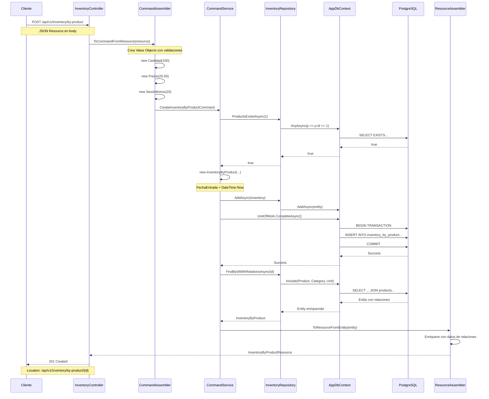
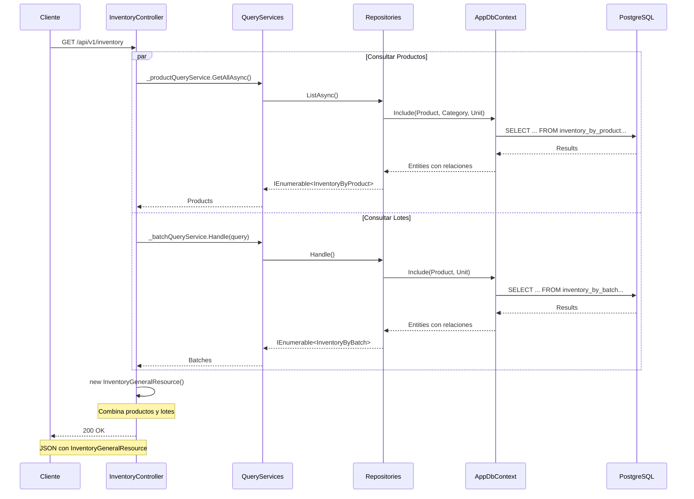
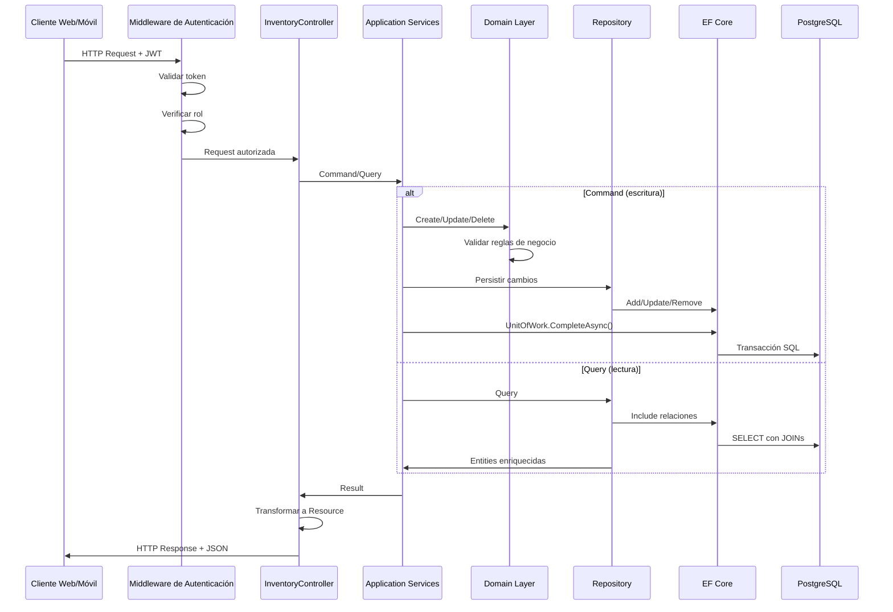

# Análisis Detallado del Módulo de Inventario

## Tabla de Contenidos
- [Arquitectura General](#arquitectura-general)
- [1. Dominio (Domain Layer)](#1-dominio-domain-layer)
- [2. Aplicación (Application Layer)](#2-aplicación-application-layer)
- [3. Infraestructura (Infrastructure Layer)](#3-infraestructura-infrastructure-layer)
- [4. Interfaces REST (API Layer)](#4-interfaces-rest-api-layer)
- [5. Flujo Completo de Datos](#5-flujo-completo-de-datos)
- [6. Patrones de Diseño Implementados](#6-patrones-de-diseño-implementados)
- [7. Características Técnicas](#7-características-técnicas)
- [8. Diagrama de Secuencia](#8-diagrama-de-secuencia)
- [9. Consideraciones de Diseño](#9-consideraciones-de-diseño)

---

## Arquitectura General

El módulo de Inventario implementa una arquitectura limpia siguiendo los principios de **Domain-Driven Design (DDD)** con una clara separación de responsabilidades:

```
┌─────────────────────────────────────────────────────────────┐
│                    Interfaces REST (API)                    │
│  ┌─────────────────┐  ┌─────────────────┐  ┌──────────────┐ │
│  │   Controllers   │  │    Resources    │  │  Assemblers   │ │
│  └─────────────────┘  └─────────────────┘  └──────────────┘ │
└─────────────────────────────────────────────────────────────┘
                              │
┌─────────────────────────────────────────────────────────────┐
│                Application Layer                            │
│  ┌─────────────────┐  ┌─────────────────┐                  │
│  │ Command Services│  │ Query Services  │                  │
│  └─────────────────┘  └─────────────────┘                  │
└─────────────────────────────────────────────────────────────┘
                              │
┌─────────────────────────────────────────────────────────────┐
│                    Domain Layer                             │
│  ┌─────────────┐  ┌─────────────┐  ┌─────────────────────┐  │
│  │  Aggregates │  │   Commands  │  │      Queries        │  │
│  │             │  │             │  │                     │  │
│  │InventoryBy  │  │CreateInvBy  │  │GetInventoryBy       │  │
│  │Product      │  │ProductCmd   │  │ProductQuery         │  │
│  │InventoryBy  │  │CreateInvBy  │  │GetInventoryBy       │  │
│  │Batch        │  │BatchCmd     │  │BatchQuery           │  │
│  │Branch       │  │CreateBranch  │  │GetBranchQuery       │  │
│  └─────────────┘  └─────────────┘  └─────────────────────┘  │
│  ┌─────────────────────────────────────────────────────────┐ │
│  │              Value Objects                              │ │
│  │  ┌──────────┐ ┌──────────┐ ┌─────────────────────────┐ │ │
│  │  │Cantidad  │ │ Precio   │ │     StockMinimo         │ │ │
│  │  └──────────┘ └──────────┘ └─────────────────────────┘ │ │
│  └─────────────────────────────────────────────────────────┘ │
└─────────────────────────────────────────────────────────────┘
                              │
┌─────────────────────────────────────────────────────────────┐
│                Infrastructure Layer                         │
│  ┌─────────────────┐  ┌─────────────────┐                  │
│  │   Repositories  │  │   DbContext     │                  │
│  │  (EF Core)      │  │   PostgreSQL     │                  │
│  └─────────────────┘  └─────────────────┘                  │
└─────────────────────────────────────────────────────────────┘
```

---

## 1. Dominio (Domain Layer)

### 1.1 Agregados Raíz

#### **InventoryByProduct**
**Archivo:** `Lot/Inventaries/Domain/Model/Aggregates/InventoryByProduct.cs`

```csharp
public class InventoryByProduct
{
    public int Id { get; private set; }
    public int ProductoId { get; private set; }  // FK → Products
    public DateTime FechaEntrada { get; private set; }
    public int Cantidad { get; private set; }
    public decimal Precio { get; private set; }
    public int StockMinimo { get; private set; }

    // Propiedad de navegación para EF Core
    public Product? Product { get; private set; }

    // Lógica de negocio del dominio
    public bool StockBajo => Cantidad <= StockMinimo;

    // Comportamientos del dominio
    public void ReduceStock(int quantity)
    {
        if (quantity <= 0)
            throw new ArgumentException("Quantity to reduce must be greater than 0", nameof(quantity));

        if (Cantidad < quantity)
            throw new ArgumentException($"Insufficient stock. Available: {Cantidad}, Requested: {quantity}", nameof(quantity));

        Cantidad -= quantity;
    }

    public void IncreaseStock(int quantity)
    {
        if (quantity <= 0)
            throw new ArgumentException("Quantity to increase must be greater than 0", nameof(quantity));

        Cantidad += quantity;
    }
}
```

**Responsabilidades:**
- Gestionar el inventario a nivel de producto individual
- Validar reglas de negocio de stock
- Mantener invariantes del dominio
- Proporcionar comportamientos para manipulación de inventario

#### **InventoryByBatch**
**Archivo:** `Lot/Inventaries/Domain/Model/Aggregates/InventoryByBatch.cs`

```csharp
public class InventoryByBatch
{
    public int Id { get; private set; }
    public int ProductoId { get; private set; }  // FK → Products
    public string Proveedor { get; private set; }
    public int UnidadId { get; private set; }    // FK → Units
    public DateTime FechaEntrada { get; private set; }
    public int Cantidad { get; private set; }
    public decimal Precio { get; private set; }

    // Propiedades de navegación para EF Core
    public Product? Product { get; private set; }
    public Unit? Unit { get; private set; }

    // Propiedad calculada del dominio
    public decimal Total => Precio * Cantidad;
}
```

**Responsabilidades:**
- Gestionar lotes específicos de productos
- Mantener trazabilidad por proveedor
- Calcular valores derivados del dominio

#### **Branch**
**Archivo:** `Lot/Inventaries/Domain/Model/Aggregates/Branch.cs`

```csharp
public class Branch
{
    public int Id { get; private set; }
    public string Name { get; private set; }
    public string Type { get; private set; }        // 'central', 'norte', 'sur', etc.
    public string Address { get; private set; }
    public decimal Latitude { get; private set; }
    public decimal Longitude { get; private set; }
    public int StockTotal { get; private set; }
    public DateTime CreatedAt { get; private set; }
    public DateTime? UpdatedAt { get; private set; }

    // Comportamientos del dominio
    public void UpdateStock(int newStockTotal)
    {
        StockTotal = newStockTotal;
        UpdatedAt = DateTime.UtcNow;
    }

    public void Update(
        string? name = null,
        string? type = null,
        string? address = null,
        decimal? latitude = null,
        decimal? longitude = null)
    {
        if (name != null) Name = name;
        if (type != null) Type = type;
        if (address != null) Address = address;
        if (latitude.HasValue) Latitude = latitude.Value;
        if (longitude.HasValue) Longitude = longitude.Value;
        UpdatedAt = DateTime.UtcNow;
    }
}
```

**Responsabilidades:**
- Representar ubicaciones físicas de almacenamiento
- Gestionar coordenadas geográficas
- Mantener estado de inventario agregado

### 1.2 Value Objects

Los Value Objects implementan inmutabilidad y validaciones del dominio:

#### **Cantidad**
**Archivo:** `Lot/Inventaries/Domain/Model/ValueObjects/Cantidad.cs`
```csharp
public record Cantidad
{
    public int Value { get; }

    public Cantidad(int value)
    {
        if (value <= 0)
            throw new ArgumentException("La cantidad debe ser mayor que cero.");

        Value = value;
    }
}
```

#### **Precio**
**Archivo:** `Lot/Inventaries/Domain/Model/ValueObjects/Precio.cs`
```csharp
public record Precio
{
    public decimal Value { get; }

    public Precio(decimal value)
    {
        if (value < 0)
            throw new ArgumentException("El precio no puede ser negativo.");

        Value = value;
    }
}
```

#### **StockMinimo**
**Archivo:** `Lot/Inventaries/Domain/Model/ValueObjects/StockMinimo.cs`
```csharp
public record StockMinimo
{
    public int Value { get; }

    public StockMinimo(int value)
    {
        if (value < 0)
            throw new ArgumentException("El stock mínimo no puede ser negativo.");

        Value = value;
    }
}
```

### 1.3 Commands y Queries

#### **CreateInventoryByProductCommand**
**Archivo:** `Lot/Inventaries/Domain/Model/Commands/CreateInventoryByProductCommand.cs`
```csharp
public class CreateInventoryByProductCommand
{
    public int ProductoId { get; }           // FK → Products
    public Cantidad Cantidad { get; }
    public Precio Precio { get; }
    public StockMinimo StockMinimo { get; }

    // Nota: FechaEntrada es automática, no se incluye en el command
}
```

#### **GetInventoryByProductQuery**
**Archivo:** `Lot/Inventaries/Domain/Model/Queries/GetInventoryByProductQuery.cs`
```csharp
public class GetInventoryByProductQuery
{
    public int Id { get; }

    public GetInventoryByProductQuery(int id)
    {
        Id = id;
    }
}
```

---

## 2. Aplicación (Application Layer)

### 2.1 Command Services

#### **InventoryByProductCommandService**
**Archivo:** `Lot/Inventaries/Application/Internal/CommandServices/InventoryByProductCommandService.cs`

```csharp
public class InventoryByProductCommandService(
    IInventoryByProductRepository repository,
    IUnitOfWork unitOfWork) : IInventoryByProductCommandService
{
    public async Task<InventoryByProduct?> Handle(CreateInventoryByProductCommand command)
    {
        try
        {
            // 1. Validar existencia del producto (integridad referencial)
            var efRepository = repository as InventoryByProductRepository;
            if (efRepository == null)
                throw new InvalidOperationException("Repository must support FK validation");

            var exists = await efRepository.ProductoExistsAsync(command.ProductoId);
            if (!exists)
                throw new ArgumentException($"Product with ID {command.ProductoId} does not exist");

            // 2. Crear agregado usando constructor con fecha automática
            var inventory = new InventoryByProduct(
                command.ProductoId,
                command.Cantidad,
                command.Precio,
                command.StockMinimo
            );

            // 3. Persistir usando Unit of Work
            await repository.AddAsync(inventory);
            await unitOfWork.CompleteAsync();

            // 4. Recargar con relaciones para respuesta enriquecida
            inventory = await efRepository.FindByIdWithRelationsAsync(inventory.Id);

            return inventory;
        }
        catch (Exception ex)
        {
            Console.WriteLine($"Error creating inventory: {ex.Message}");
            return null;
        }
    }

    public async Task<bool> DeleteAsync(int id)
    {
        try
        {
            var entity = await repository.FindByIdAsync(id);
            if (entity == null) return false;

            await repository.DeleteAsync(id);
            await unitOfWork.CompleteAsync();
            return true;
        }
        catch (Exception ex)
        {
            Console.WriteLine($"Error deleting inventory with ID {id}: {ex.Message}");
            return false;
        }
    }
}
```

**Responsabilidades:**
- Coordinar casos de uso del dominio
- Validar reglas de negocio a nivel de aplicación
- Orquestar transacciones a través de Unit of Work
- Manejar errores y excepciones

### 2.2 Query Services

#### **InventoryByProductQueryService**
**Archivo:** `Lot/Inventaries/Application/Internal/QuerysServices/InventoryByProductQueryService.cs`

```csharp
public class InventoryByProductQueryService : IInventoryByProductQueryService
{
    private readonly IInventoryByProductRepository _repository;

    public InventoryByProductQueryService(IInventoryByProductRepository repository)
    {
        _repository = repository;
    }

    public async Task<IEnumerable<InventoryByProduct>> GetAllAsync()
    {
        return await _repository.ListAsync();
    }

    public async Task<InventoryByProduct?> GetByIdAsync(int id)
    {
        return await _repository.FindByIdAsync(id);
    }
}
```

**Responsabilidades:**
- Optimizar consultas de lectura
- Proporcionar datos para la presentación
- Separar operaciones de lectura de escritura (CQRS)

---

## 3. Infraestructura (Infrastructure Layer)

### 3.1 Repositories con Entity Framework Core

#### **InventoryByProductRepository**
**Archivo:** `Lot/Inventaries/Infraestructure/Persistence/EFC/Repositories/InventoryByProductRepository.cs`

```csharp
public class InventoryByProductRepository : IInventoryByProductRepository
{
    private readonly AppDbContext _context;

    public InventoryByProductRepository(AppDbContext context)
    {
        _context = context;
    }

    public async Task<IEnumerable<InventoryByProduct>> ListAsync()
    {
        // Carga ansiosa de relaciones para datos enriquecidos
        return await _context.Set<InventoryByProduct>()
            .Include(p => p.Product)
            .ThenInclude(p => p.Category)
            .Include(p => p.Product)
            .ThenInclude(p => p.Unit)
            .ToListAsync();
    }

    public async Task<InventoryByProduct?> FindByIdAsync(int id)
    {
        return await _context.Set<InventoryByProduct>()
            .Include(p => p.Product)
            .ThenInclude(p => p.Category)
            .Include(p => p.Product)
            .ThenInclude(p => p.Unit)
            .FirstOrDefaultAsync(p => p.Id == id);
    }

    public async Task<InventoryByProduct?> FindByIdWithRelationsAsync(int id)
    {
        var entity = await _context.Set<InventoryByProduct>()
            .Include(p => p.Product)
            .ThenInclude(p => p.Category)
            .Include(p => p.Product)
            .ThenInclude(p => p.Unit)
            .FirstOrDefaultAsync(p => p.Id == id);

        return entity;
    }

    public async Task AddAsync(InventoryByProduct product)
    {
        await _context.Set<InventoryByProduct>().AddAsync(product);
        // Nota: SaveChangesAsync se maneja en UnitOfWork
    }

    public async Task UpdateAsync(InventoryByProduct product)
    {
        _context.Set<InventoryByProduct>().Update(product);
    }

    public async Task DeleteAsync(int id)
    {
        var entity = await _context.Set<InventoryByProduct>().FindAsync(id);
        if (entity != null)
        {
            _context.Set<InventoryByProduct>().Remove(entity);
        }
    }

    // Métodos de validación de relaciones
    public async Task<bool> ProductoExistsAsync(int productoId)
    {
        return await _context.Set<Product>()
            .AnyAsync(p => p.Id == productoId);
    }

    public async Task<Product?> GetProductByIdAsync(int productoId)
    {
        return await _context.Set<Product>()
            .Include(p => p.Category)
            .Include(p => p.Unit)
            .FirstOrDefaultAsync(p => p.Id == productoId);
    }

    // Métodos de búsqueda por nombre
    public async Task<Product?> FindProductByNameAsync(string nombre, string? categoria = null)
    {
        var query = _context.Set<Product>()
            .Include(p => p.Category)
            .Include(p => p.Unit)
            .AsQueryable();

        query = query.Where(p => p.Name.ToLower() == nombre.ToLower());

        if (!string.IsNullOrWhiteSpace(categoria))
        {
            query = query.Where(p => p.Category.Name.ToLower() == categoria.ToLower());
        }

        return await query.FirstOrDefaultAsync();
    }
}
```

**Características:**
- Implementación del Repository Pattern
- Uso de Entity Framework Core con PostgreSQL
- Carga ansiosa de relaciones (Include/ThenInclude)
- Validación de integridad referencial
- Sin SaveChangesAsync para mantener Unit of Work

### 3.2 Unit of Work

**Archivo:** `Lot/Shared/Infraestructure/Persistence/EFC/Repositories/UnitOfWorks.cs`

```csharp
public class UnitOfWorks : IUnitOfWork
{
    private readonly AppDbContext _context;

    public UnitOfWorks(AppDbContext context)
    {
        _context = context;
    }

    public async Task CompleteAsync()
    {
        await _context.SaveChangesAsync();
    }
}
```

---

## 4. Interfaces REST (API Layer)

### 4.1 Controllers

#### **InventoryController**
**Archivo:** `Lot/Inventaries/Interfaces/REST/InventoryController.cs`

```csharp
[ApiController]
[Route("api/v1/inventory")]
[Produces(MediaTypeNames.Application.Json)]
[SwaggerTag("Operaciones del inventario general, por producto y por lote.")]
[AuthorizeRoles("Administrator", "Employee")]
public class InventoryController : ControllerBase
{
    private readonly IInventoryByProductCommandService _productCommandService;
    private readonly IInventoryByProductQueryService _productQueryService;
    private readonly IInventoryByBatchCommandService _batchCommandService;
    private readonly IInventoryByBatchQueryService _batchQueryService;

    public InventoryController(
        IInventoryByProductCommandService productCommandService,
        IInventoryByProductQueryService productQueryService,
        IInventoryByBatchCommandService batchCommandService,
        IInventoryByBatchQueryService batchQueryService)
    {
        _productCommandService = productCommandService;
        _productQueryService = productQueryService;
        _batchCommandService = batchCommandService;
        _batchQueryService = batchQueryService;
    }

    // === ENDPOINTS PRINCIPALES ===

    [HttpGet]
    [SwaggerOperation(
        Summary = "Obtener todos los registros de inventario",
        Description = "Resumen general del inventario, combinando productos y lotes.",
        OperationId = "GetAllInventory")]
    [SwaggerResponse(StatusCodes.Status200OK, "Lista general obtenida.", typeof(InventoryGeneralResource))]
    public async Task<IActionResult> GetAllInventory()
    {
        var products = await _productQueryService.GetAllAsync();
        var batches = await _batchQueryService.Handle(new GetInventoryByBatchQuery());

        var response = new InventoryGeneralResource
        {
            Productos = products.Select(p => InventoryByProductResourceAssembler.ToResourceFromEntity(p)).ToList(),
            Lotes = batches.Select(b => InventoryByBatchResourceAssembler.ToResource(b)).ToList(),
        };

        return Ok(response);
    }

    [HttpPost("by-product")]
    [SwaggerOperation("Crear Inventario por Producto", OperationId = "CreateInventoryByProduct")]
    [SwaggerResponse(StatusCodes.Status201Created, "Inventario por producto creado correctamente.", typeof(InventoryByProductResource))]
    [SwaggerResponse(StatusCodes.Status400BadRequest, "Datos inválidos proporcionados.")]
    public async Task<IActionResult> CreateByProduct([FromBody] CreateInventoryByProductResource resource)
    {
        try
        {
            // 1. Transform Resource → Command
            var command = CreateInventoryByProductCommandAssembler.ToCommandFromResource(resource);

            // 2. Execute Command
            var result = await _productCommandService.Handle(command);

            if (result == null)
                return BadRequest("No se pudo crear el inventario. Verifique los datos proporcionados.");

            // 3. Transform Entity → Resource
            var responseResource = InventoryByProductResourceAssembler.ToResourceFromEntity(result);

            return CreatedAtAction(nameof(GetByProductById), new { id = result.Id }, responseResource);
        }
        catch (ArgumentException ex)
        {
            return BadRequest($"Error de validación: {ex.Message}");
        }
        catch (Exception ex)
        {
            return StatusCode(500, $"Error interno del servidor: {ex.Message}");
        }
    }

    [HttpGet("by-product/{id}")]
    [SwaggerOperation("Obtener Inventario por Producto por ID", OperationId = "GetInventoryByProductById")]
    [SwaggerResponse(StatusCodes.Status200OK, "Inventario encontrado.", typeof(InventoryByProductResource))]
    public async Task<IActionResult> GetByProductById(int id)
    {
        var result = await _productQueryService.GetByIdAsync(id);
        if (result == null) return NotFound();

        var resource = InventoryByProductResourceAssembler.ToResourceFromEntity(result);
        return Ok(resource);
    }

    [HttpDelete("by-product/{id}")]
    [SwaggerOperation("Eliminar Inventario por Producto por ID", OperationId = "DeleteInventoryByProductById")]
    [SwaggerResponse(StatusCodes.Status204NoContent, "Inventario eliminado.")]
    [SwaggerResponse(StatusCodes.Status404NotFound, "Inventario no encontrado.")]
    public async Task<IActionResult> DeleteByProductById(int id)
    {
        var deleted = await _productCommandService.DeleteAsync(id);
        if (!deleted) return NotFound();
        return NoContent();
    }
}
```

### 4.2 Resources (DTOs)

#### **CreateInventoryByProductResource**
**Archivo:** `Lot/Inventaries/Interfaces/REST/Resources/CreateInventoryByProductResource.cs`

```csharp
/// <summary>
/// Recurso para crear inventario por producto.
/// Conecta con productos existentes mediante ID.
/// </summary>
public class CreateInventoryByProductResource
{
    public int ProductoId { get; set; }           // FK → Products
    public int Cantidad { get; set; }
    public decimal Precio { get; set; }
    public int StockMinimo { get; set; }

    // Nota: FechaEntrada es automática y no se incluye
}
```

#### **InventoryByProductResource**
**Archivo:** `Lot/Inventaries/Interfaces/REST/Resources/InventoryByProductResource.cs`

```csharp
/// <summary>
/// Recurso de inventario por producto para la API REST.
/// Enriquecido con datos de relaciones.
/// </summary>
public class InventoryByProductResource
{
    // Identificación
    public int Id { get; set; }
    public int ProductoId { get; set; }

    // Datos enriquecidos de relaciones
    public string ProductoNombre { get; set; } = string.Empty;      // Product.Name
    public string CategoriaNombre { get; set; } = string.Empty;     // Product.Category.Name
    public string UnidadNombre { get; set; } = string.Empty;        // Product.Unit.Name
    public string UnidadAbreviacion { get; set; } = string.Empty;   // Product.Unit.Abbreviation

    // Campos originales
    public DateTime FechaEntrada { get; set; }
    public int Cantidad { get; set; }
    public decimal Precio { get; set; }
    public int StockMinimo { get; set; }

    // Propiedades calculadas
    public decimal Total => Precio * Cantidad;
    public bool StockBajo => Cantidad <= StockMinimo;
}
```

### 4.3 Assemblers (Transformación)

#### **CreateInventoryByProductCommandAssembler**
**Archivo:** `Lot/Inventaries/Interfaces/REST/Transform/CreateInventoryByProductCommandAssembler.cs`

```csharp
/// <summary>
/// Assembler para transformar Resources a Commands.
/// Implementa validación y creación de Value Objects.
/// </summary>
public static class CreateInventoryByProductCommandAssembler
{
    public static CreateInventoryByProductCommand ToCommandFromResource(CreateInventoryByProductResource resource)
    {
        return new CreateInventoryByProductCommand(
            productoId: resource.ProductoId,
            cantidad: new Cantidad(resource.Cantidad),
            precio: new Precio(resource.Precio),
            stockMinimo: new StockMinimo(resource.StockMinimo)
        );
    }
}
```

#### **InventoryByProductResourceAssembler**
**Archivo:** `Lot/Inventaries/Interfaces/REST/Transform/InventoryByProductResourceAssembler.cs`

```csharp
/// <summary>
/// Assembler para transformar Entities a Resources enriquecidos.
/// Accede a datos de relaciones para enriquecer respuestas.
/// </summary>
public static class InventoryByProductResourceAssembler
{
    public static InventoryByProductResource ToResourceFromEntity(InventoryByProduct entity)
    {
        return new InventoryByProductResource
        {
            Id = entity.Id,
            ProductoId = entity.ProductoId,

            // Datos enriquecidos de relaciones (con null-safe operators)
            ProductoNombre = entity.Product?.Name ?? string.Empty,
            CategoriaNombre = entity.Product?.Category?.Name ?? string.Empty,
            UnidadNombre = entity.Product?.Unit?.Name ?? string.Empty,
            UnidadAbreviacion = entity.Product?.Unit?.Abbreviation ?? string.Empty,

            // Datos originales
            FechaEntrada = entity.FechaEntrada,
            Cantidad = entity.Cantidad,
            Precio = entity.Precio,
            StockMinimo = entity.StockMinimo
        };
    }
}
```

---

## 5. Flujo Completo de Datos

### 5.1 Crear Inventario por Producto

```
HTTP POST /api/v1/inventory/by-product
Content-Type: application/json
Authorization: Bearer <token>

{
    "ProductoId": 1,
    "Cantidad": 100,
    "Precio": 25.50,
    "StockMinimo": 20
}
```

**Secuencia completa:**



### 5.2 Consultar Inventario General

```
HTTP GET /api/v1/inventory
Authorization: Bearer <token>
```

**Secuencia:**



---

## 6. Patrones de Diseño Implementados

### 6.1 Domain-Driven Design (DDD)

- **Agregados Raíz**: InventoryByProduct, InventoryByBatch, Branch
- **Value Objects**: Cantidad, Precio, StockMinimo (inmutables)
- **Entidades del Dominio**: Lógica de negocio encapsulada
- **Invariantes del Dominio**: Validaciones en constructores y comportamientos

### 6.2 Repository Pattern

```csharp
public interface IInventoryByProductRepository
{
    Task<IEnumerable<InventoryByProduct>> ListAsync();
    Task<InventoryByProduct?> FindByIdAsync(int id);
    Task AddAsync(InventoryByProduct product);
    Task UpdateAsync(InventoryByProduct product);
    Task DeleteAsync(int id);
}
```

- **Abstracción del acceso a datos**
- **Inyección de dependencias**
- **Facilita pruebas unitarias**
- **Desacoplamiento de la tecnología**

### 6.3 Unit of Work Pattern

```csharp
public interface IUnitOfWork
{
    Task CompleteAsync();
}
```

- **Transacciones atómicas**
- **Consistencia de datos**
- **Rollback implícito en errores**
- **Desacoplamiento de DbContext**

### 6.4 CQRS (Command Query Responsibility Segregation)

- **Commands**: Crear, actualizar, eliminar (Write Model)
- **Queries**: Consultar, listar (Read Model)
- **Separación de responsabilidades**
- **Optimización independiente**

### 6.5 Assembler Pattern

- **Transformación Resource ↔ Command/Entity**
- **Enriquecimiento de datos**
- **Validaciones en capa de transformación**
- **Separación de DTOs del dominio**

### 6.6 Specification Pattern (implícito)

- **Filtros opcionales en queries**
- **Composición de consultas**
- **Validaciones complejas**

---

## 7. Características Técnicas

### 7.1 Seguridad

- **Autorización por roles**: `[AuthorizeRoles("Administrator", "Employee")]`
- **JWT Tokens**: Validación automática
- **CORS**: Configurado para desarrollo y producción
- **Validaciones**: En múltiples capas

### 7.2 Validaciones

#### **En Value Objects (Dominio)**
```csharp
if (value <= 0)
    throw new ArgumentException("La cantidad debe ser mayor que cero.");
```

#### **En Application Layer**
```csharp
var exists = await repository.ProductoExistsAsync(command.ProductoId);
if (!exists)
    throw new ArgumentException($"Product with ID {command.ProductoId} does not exist");
```

#### **En Controllers**
```csharp
if (result == null)
    return BadRequest("No se pudo crear el inventario. Verifique los datos proporcionados.");
```

### 7.3 Manejo de Errores

- **try-catch** en Command Services
- **Logging** en consola
- **HTTP Status Codes** apropiados
- **Mensajes descriptivos**

### 7.4 Optimizaciones

- **Eager Loading**: Include/ThenInclude para relaciones
- **Async/Await**: Operaciones asíncronas
- **Connection Pooling**: Configurado por defecto
- **Índices en BD**: Definidos en AppDbContext

### 7.5 Enriquecimiento de Datos

```csharp
// Carga de relaciones para respuestas enriquecidas
.Include(p => p.Product)
.ThenInclude(p => p.Category)
.Include(p => p.Product)
.ThenInclude(p => p.Unit)
```

- **Datos de relaciones**: Nombre de producto, categoría, unidad
- **Propiedades calculadas**: Total, StockBajo
- **Null-safe operators**: Evita NullReferenceException

---

## 8. Diagrama de Secuencia (General)



---

## 9. Consideraciones de Diseño

### 9.1 Decisiones Arquitectónicas

1. **DDD con Clean Architecture**
   - Beneficios: Mantenibilidad, escalabilidad, testabilidad
   - Trade-off: Complejidad inicial mayor

2. **CQRS con EF Core**
   - Beneficios: Optimización independiente de lectura/escritura
   - Trade-off: Más clases y separación de lógica

3. **PostgreSQL vs MySQL**
   - Beneficios: Mejor soporte para tipos complejos, JSONB
   - Trade-off: Curva de aprendizaje

4. **JWT con Claims-based Authorization**
   - Beneficios: Stateless, escalable
   - Trade-off: Manejo de refresh tokens necesario

### 9.2 Patrones Anti-Corruption

```csharp
// Value Objects protegen el dominio de datos inválidos
public record Cantidad
{
    public int Value { get; }
    public Cantidad(int value)
    {
        if (value <= 0) throw new ArgumentException();
        Value = value;
    }
}

// Assemblers protegen la API de cambios en el dominio
public static InventoryByProductResource ToResourceFromEntity(InventoryByProduct entity)
{
    return new InventoryByProductResource
    {
        ProductoNombre = entity.Product?.Name ?? string.Empty,
        // Null-safe operators protegen contra nulls
    };
}
```

### 9.3 Escalabilidad Futura

1. **Microservicios**: Cada bounded context puede extraerse
2. **Event Sourcing**: Command pattern preparado para eventos
3. **CQRS con Read Models**: Puede evolucionar a proyecciones optimizadas
4. **Message Queue**: Commands pueden procesarse asíncronamente

### 9.4 Consideraciones de Rendimiento

1. **N+1 Problem**: Resuelto con Include/ThenInclude
2. **Indexación**: Índices en FKs y campos de búsqueda
3. **Caching**: Puede implementarse en Query Services
4. **Pagination**: Fácil de implementar en queries

### 9.5 Testing Strategy

```csharp
// Unit Tests - Domain Layer
[Test]
public void ReduceStock_InsufficientStock_ThrowsException()
{
    var inventory = new InventoryByProduct(1, new Cantidad(10), new Precio(100), new StockMinimo(5));
    Assert.Throws<ArgumentException>(() => inventory.ReduceStock(15));
}

// Integration Tests - Repository Layer
[Test]
public async Task AddAsync_ValidInventory_StoresInDatabase()
{
    // Arrange con DbContext en memoria
    var context = CreateInMemoryDbContext();
    var repository = new InventoryByProductRepository(context);

    // Act
    await repository.AddAsync(inventory);
    await context.SaveChangesAsync();

    // Assert
    var saved = await context.Set<InventoryByProduct>().FirstAsync();
    Assert.AreEqual(1, saved.ProductoId);
}
```

---

## Resumen Ejecutivo

El módulo de Inventario implementa una arquitectura robusta y escalable siguiendo principios de Domain-Driven Design con las siguientes características clave:

✅ **Separación clara de responsabilidades** a través de capas bien definidas
✅ **Dominio rico** con lógica de negocio encapsulada y validaciones robustas
✅ **Persistencia desacoplada** usando Repository y Unit of Work patterns
✅ **API RESTful** con DTOs enriquecidos y transformaciones seguras
✅ **Seguridad por roles** con JWT y autorización granular
✅ **Rendimiento optimizado** con carga ansiosa de relaciones
✅ **Mantenibilidad** alta gracias a pruebas y desacoplamiento

La implementación actual está preparada para evolucionar hacia microservicios, Event Sourcing, o escalamiento horizontal según las necesidades futuras del negocio.