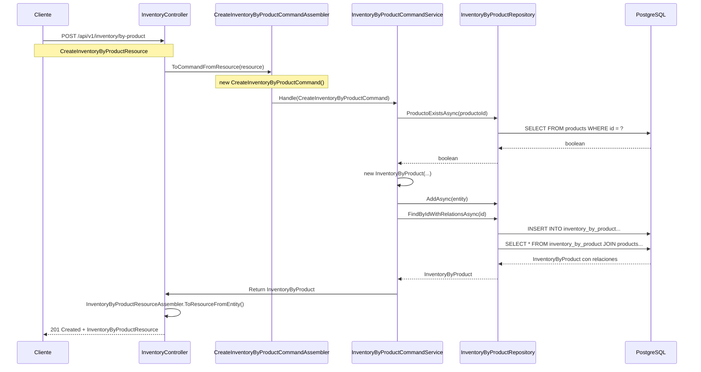

# 📋 GUÍA DE IMPLEMENTACIÓN: NOMBRES EXACTOS Y FLUJO DE INVENTORY

## ⚠️ IMPORTANTE: LEER ANTES DE IMPLEMENTAR

Este documento contiene los **NOMBRES EXACTOS** y el flujo completo para la implementación de Update Inventory. **NO CAMBIAR NINGÚN NOMBRE** - están así por una razón específica.

---

## 🏗️ ESTRUCTURA COMPLETA DE ARCHIVOS Y NOMBRES

### 1. CONTROLLERS (Capa API)
```
/Inventaries/Interfaces/REST/
├── InventoryController.cs          ✅ EXISTE
└── BranchController.cs            ✅ EXISTE (referencia)
```

### 2. DOMAIN SERVICES (Interfaces)
```
/Inventaries/Domain/Services/
├── IInventoryByProductCommandService.cs    ✅ EXISTE
├── IInventoryByBatchCommandService.cs      ✅ EXISTE
├── IInventoryByProductQueryService.cs      ✅ EXISTE
├── IInventoryByBatchQueryService.cs        ✅ EXISTE
├── IBranchCommandService.cs                ✅ EXISTE (referencia)
└── IBranchQueryService.cs                  ✅ EXISTE (referencia)
```

### 3. APPLICATION SERVICES (Implementaciones)
```
/Inventaries/Application/Internal/CommandServices/
├── InventoryByProductCommandService.cs    ✅ EXISTE
├── InventoryByBatchCommandService.cs      ✅ EXISTE
└── BranchCommandService.cs                ✅ EXISTE (referencia)

/Inventaries/Application/Internal/QuerysServices/
├── InventoryByProductQueryService.cs      ✅ EXISTE
├── InventoryByBatchQueryService.cs        ✅ EXISTE
└── BranchQueryService.cs                  ✅ EXISTE (referencia)
```

### 4. DOMAIN MODEL
```
/Inventaries/Domain/Model/
├── Aggregates/
│   ├── InventoryByProduct.cs              ✅ EXISTE
│   ├── InventoryByBatch.cs                ✅ EXISTE
│   └── Branch.cs                          ✅ EXISTE (referencia)
├── Commands/
│   ├── CreateInventoryByProductCommand.cs  ✅ EXISTE
│   ├── CreateInventoryByBatchCommand.cs    ✅ EXISTE
│   └── UpdateBranchCommand.cs              ✅ EXISTE (referencia)
├── Queries/
│   ├── GetInventoryByProductQuery.cs       ✅ EXISTE
│   └── GetInventoryByBatchQuery.cs         ✅ EXISTE
└── ValueObjects/
    ├── Cantidad.cs                         ✅ EXISTE
    ├── Precio.cs                           ✅ EXISTE
    └── StockMinimo.cs                      ✅ EXISTE
```

### 5. RESOURCES (DTOs)
```
/Inventaries/Interfaces/REST/Resources/
├── CreateInventoryByProductResource.cs     ✅ EXISTE
├── CreateInventoryByBatchResource.cs       ✅ EXISTE
├── InventoryByProductResource.cs           ✅ EXISTE
├── InventoryByBatchResource.cs             ✅ EXISTE
├── InventoryGeneralResource.cs.cs          ✅ EXISTE
├── CreateBranchResource.cs                 ✅ EXISTE (referencia)
└── BranchResource.cs                       ✅ EXISTE (referencia)
```

### 6. ASSEMBLERS (Transformaciones)
```
/Inventaries/Interfaces/REST/Transform/
├── CreateInventoryByProductCommandAssembler.cs     ✅ EXISTE
├── CreateInventoryByBatchCommandAssembler.cs       ✅ EXISTE
├── InventoryByProductResourceAssembler.cs          ✅ EXISTE
├── InventoryByBatchResourceAssembler.cs            ✅ EXISTE
└── BranchResourceAssembler.cs                       ✅ EXISTE (referencia)
```

### 7. REPOSITORIES
```
/Inventaries/Domain/Repositories/
├── IInventoryByProductRepository.cs           ✅ EXISTE
├── IInventoryByBatchRepository.cs             ✅ EXISTE
├── IBranchRepository.cs                       ✅ EXISTE (referencia)

/Inventaries/Infrastructure/Persistence/EFC/Repositories/
├── InventoryByProductRepository.cs            ✅ EXISTE
├── InventoryByBatchRepository.cs              ✅ EXISTE
└── BranchRepository.cs                        ✅ EXISTE (referencia)
```

---

## 🔄 FLUJO COMPLETO DE DATOS (NOMBRES EXACTOS)

### CREACIÓN DE INVENTORY BY PRODUCT (Flujo de Referencia)



---

## 📝 PATRONES DE NOMBRADO EXACTOS

### 1. INTERFACES DE COMMAND SERVICES

```csharp
// ✅ NOMBRES EXACTOS - NO CAMBIAR
public interface IInventoryByProductCommandService
{
    Task<InventoryByProduct?> Handle(CreateInventoryByProductCommand command);
    // ❌ AGREGAR ESTE MÉTODO FALTANTE:
    Task<InventoryByProduct?> Handle(UpdateInventoryByProductCommand command);  // NUEVO
    Task<bool> DeleteAsync(int id);
}

public interface IInventoryByBatchCommandService
{
    Task<InventoryByBatch?> Handle(CreateInventoryByBatchCommand command);
    // ❌ AGREGAR ESTE MÉTODO FALTANTE:
    Task<InventoryByBatch?> Handle(UpdateInventoryByBatchCommand command);      // NUEVO
    Task<bool> DeleteAsync(int id);
}
```

### 2. INTERFACES DE QUERY SERVICES

```csharp
// ✅ NOMBRES EXACTOS - NO CAMBIAR
public interface IInventoryByProductQueryService
{
    Task<IEnumerable<InventoryByProduct>> GetAllAsync();
    Task<InventoryByProduct?> GetByIdAsync(int id);
}

public interface IInventoryByBatchQueryService
{
    Task<IEnumerable<InventoryByBatch>> Handle(GetInventoryByBatchQuery query);
    Task<InventoryByBatch?> GetByIdAsync(int id);
}
```

### 3. REPOSITORIES

```csharp
// ✅ NOMBRES EXACTOS - NO CAMBIAR
public interface IInventoryByProductRepository
{
    Task<IEnumerable<InventoryByProduct>> ListAsync();
    Task<InventoryByProduct?> FindByIdAsync(int id);
    Task AddAsync(InventoryByProduct product);
    Task UpdateAsync(InventoryByProduct product);  // ✅ YA EXISTE
    Task DeleteAsync(int id);

    // Métodos auxiliares existentes
    Task<Product?> FindProductByNameAsync(string nombre, string? categoria = null);
    Task<IEnumerable<Product>> SearchProductsByNameAsync(string nombre, string? categoria = null);
    Task<bool> ProductoExistsAsync(int productoId);                     // EN IMPLEMENTACIÓN
    Task<InventoryByProduct?> FindByIdWithRelationsAsync(int id);       // EN IMPLEMENTACIÓN
}

public interface IInventoryByBatchRepository
{
    Task<IEnumerable<InventoryByBatch>> ListAsync();
    Task<InventoryByBatch?> FindByIdAsync(int id);
    Task AddAsync(InventoryByBatch batch);
    // ❌ FALTA UpdateAsync - DEBE AGREGARSE
    Task UpdateAsync(InventoryByBatch batch);                         // NUEVO
    Task DeleteAsync(int id);

    // Métodos auxiliares existentes
    Task<Product?> FindProductByNameAsync(string nombre, string? categoria = null);
    Task<IEnumerable<Product>> SearchProductsByNameAsync(string nombre, string? categoria = null);
    Task<bool> ProductoExistsAsync(int productoId);                   // EN IMPLEMENTACIÓN
    Task<bool> UnitExistsAsync(int unidadId);                         // NUEVO
    Task<InventoryByBatch?> FindByIdWithRelationsAsync(int id);      // EN IMPLEMENTACIÓN
}
```

### 4. CONTROLLER

```csharp
// ✅ NOMBRES EXACTOS - NO CAMBIAR
[ApiController]
[Route("api/v1/inventory")]
public class InventoryController : ControllerBase
{
    private readonly IInventoryByProductCommandService _productCommandService;
    private readonly IInventoryByProductQueryService _productQueryService;
    private readonly IInventoryByBatchCommandService _batchCommandService;
    private readonly IInventoryByBatchQueryService _batchQueryService;

    // ✅ MÉTODOS EXISTENTES
    [HttpGet]
    public async Task<IActionResult> GetAllInventory()

    [HttpPost("by-product")]
    public async Task<IActionResult> CreateByProduct([FromBody] CreateInventoryByProductResource resource)

    [HttpGet("by-product")]
    public async Task<IActionResult> GetAllByProduct([FromQuery] ...)

    [HttpGet("by-product/{id}")]
    public async Task<IActionResult> GetByProductById(int id)

    [HttpDelete("by-product/{id}")]
    public async Task<IActionResult> DeleteByProductById(int id)

    [HttpPost("by-batch")]
    public async Task<IActionResult> CreateByBatch([FromBody] CreateInventoryByBatchResource resource)

    [HttpGet("by-batch")]
    public async Task<IActionResult> GetAllByBatch([FromQuery] ...)

    [HttpGet("by-batch/{id}")]
    public async Task<IActionResult> GetByBatchById(int id)

    [HttpDelete("by-batch/{id}")]
    public async Task<IActionResult> DeleteByBatchById(int id)

    // ❌ MÉTODOS FALTANTES POR AGREGAR:
    [HttpPut("by-product/{id}")]
    public async Task<IActionResult> UpdateByProduct(int id, [FromBody] UpdateInventoryByProductResource resource)

    [HttpPut("by-batch/{id}")]
    public async Task<IActionResult> UpdateByBatch(int id, [FromBody] UpdateInventoryByBatchResource resource)

    [HttpPatch("by-product/{id}/stock")]
    public async Task<IActionResult> UpdateProductStock(int id, [FromBody] UpdateStockResource stockResource)
}
```

---

## 🎯 ARCHIVOS NUEVOS A CREAR (NOMBRES EXACTOS)

### 1. COMMANDS (Domain Layer)

```csharp
// /Inventaries/Domain/Model/Commands/UpdateInventoryByProductCommand.cs
public class UpdateInventoryByProductCommand
{
    public int Id { get; }
    public int? ProductoId { get; }
    public Cantidad? Cantidad { get; }
    public Precio? Precio { get; }
    public StockMinimo? StockMinimo { get; }

    public UpdateInventoryByProductCommand(int id, int? productoId = null, Cantidad? cantidad = null, Precio? precio = null, StockMinimo? stockMinimo = null)
}

// /Inventaries/Domain/Model/Commands/UpdateInventoryByBatchCommand.cs
public class UpdateInventoryByBatchCommand
{
    public int Id { get; }
    public int? ProductoId { get; }
    public string? Proveedor { get; }
    public int? UnidadId { get; }
    public Cantidad? Cantidad { get; }
    public Precio? Precio { get; }

    public UpdateInventoryByBatchCommand(int id, int? productoId = null, string? proveedor = null, int? unidadId = null, Cantidad? cantidad = null, Precio? precio = null)
}
```

### 2. RESOURCES (API Layer)

```csharp
// /Inventaries/Interfaces/REST/Resources/UpdateInventoryByProductResource.cs
public class UpdateInventoryByProductResource
{
    public int? ProductoId { get; set; }
    public int? Cantidad { get; set; }
    public decimal? Precio { get; set; }
    public int? StockMinimo { get; set; }
}

// /Inventaries/Interfaces/REST/Resources/UpdateInventoryByBatchResource.cs
public class UpdateInventoryByBatchResource
{
    public int? ProductoId { get; set; }
    public string? Proveedor { get; set; }
    public int? UnidadId { get; set; }
    public int? Cantidad { get; set; }
    public decimal? Precio { get; set; }
}

// /Inventaries/Interfaces/REST/Resources/UpdateStockResource.cs
public class UpdateStockResource
{
    public int Cantidad { get; set; }
    public decimal Precio { get; set; }
    public int StockMinimo { get; set; }
}
```

### 3. ASSEMBLERS (API Layer)

```csharp
// /Inventaries/Interfaces/REST/Transform/UpdateInventoryByProductCommandAssembler.cs
public static class UpdateInventoryByProductCommandAssembler
{
    public static UpdateInventoryByProductCommand ToCommandFromResource(int id, UpdateInventoryByProductResource resource)
}

// /Inventaries/Interfaces/REST/Transform/UpdateInventoryByBatchCommandAssembler.cs
public static class UpdateInventoryByBatchCommandAssembler
{
    public static UpdateInventoryByBatchCommand ToCommandFromResource(int id, UpdateInventoryByBatchResource resource)
}
```

---

## 🔧 MÉTODOS A AGREGAR EN ARCHIVOS EXISTENTES

### 1. ENTIDADES DEL DOMINIO

```csharp
// /Inventaries/Domain/Model/Aggregates/InventoryByProduct.cs
public class InventoryByProduct
{
    // ❌ AGREGAR ESTE MÉTODO:
    public void Update(
        int? productoId = null,
        Cantidad? cantidad = null,
        Precio? precio = null,
        StockMinimo? stockMinimo = null)
    {
        if (productoId.HasValue && productoId.Value != ProductoId)
            ProductoId = productoId.Value;

        if (cantidad.HasValue && cantidad.Value != Cantidad)
            Cantidad = cantidad.Value;

        if (precio.HasValue && precio.Value != Precio)
            Precio = precio.Value;

        if (stockMinimo.HasValue && stockMinimo.Value != StockMinimo)
            StockMinimo = stockMinimo.Value;
    }
}

// /Inventaries/Domain/Model/Aggregates/InventoryByBatch.cs
public class InventoryByBatch
{
    // ❌ AGREGAR ESTE MÉTODO:
    public void Update(
        int? productoId = null,
        string? proveedor = null,
        int? unidadId = null,
        Cantidad? cantidad = null,
        Precio? precio = null)
    {
        if (productoId.HasValue && productoId.Value != ProductoId)
            ProductoId = productoId.Value;

        if (proveedor != null && proveedor != Proveedor)
            Proveedor = proveedor;

        if (unidadId.HasValue && unidadId.Value != UnidadId)
            UnidadId = unidadId.Value;

        if (cantidad.HasValue && cantidad.Value != Cantidad)
            Cantidad = cantidad.Value;

        if (precio.HasValue && precio.Value != Precio)
            Precio = precio.Value;
    }
}
```

### 2. COMMAND SERVICES

```csharp
// /Inventaries/Application/Internal/CommandServices/InventoryByProductCommandService.cs
public class InventoryByProductCommandService : IInventoryByProductCommandService
{
    // ❌ AGREGAR ESTE MÉTODO:
    public async Task<InventoryByProduct?> Handle(UpdateInventoryByProductCommand command)
    {
        // Implementación siguiendo el patrón de BranchCommandService
    }
}

// /Inventaries/Application/Internal/CommandServices/InventoryByBatchCommandService.cs
public class InventoryByBatchCommandService : IInventoryByBatchCommandService
{
    // ❌ AGREGAR ESTE MÉTODO:
    public async Task<InventoryByBatch?> Handle(UpdateInventoryByBatchCommand command)
    {
        // Implementación similar al de InventoryByProductCommandService
    }
}
```

### 3. REPOSITORIES

```csharp
// /Inventaries/Infrastructure/Persistence/EFC/Repositories/InventoryByBatchRepository.cs
public class InventoryByBatchRepository : IInventoryByBatchRepository
{
    // ❌ AGREGAR ESTE MÉTODO FALTANTE:
    public async Task UpdateAsync(InventoryByBatch batch)
    {
        _context.Set<InventoryByBatch>().Update(batch);
    }

    // ❌ AGREGAR ESTOS MÉTODOS AUXILIARES:
    public async Task<bool> UnitExistsAsync(int unidadId)
    {
        return await _context.Set<Unit>().AnyAsync(u => u.Id == unidadId);
    }

    public async Task<InventoryByBatch?> FindByIdWithRelationsAsync(int id)
    {
        return await _context.Set<InventoryByBatch>()
            .Include(b => b.Product)
            .ThenInclude(p => p.Category)
            .Include(b => b.Unit)
            .FirstOrDefaultAsync(b => b.Id == id);
    }
}
```

---

## 📋 CHECKLIST FINAL DE IMPLEMENTACIÓN

### ✅ ARCHIVOS NUEVOS A CREAR (CON NOMBRES EXACTOS)

- [ ] `Lot/Inventaries/Domain/Model/Commands/UpdateInventoryByProductCommand.cs`
- [ ] `Lot/Inventaries/Domain/Model/Commands/UpdateInventoryByBatchCommand.cs`
- [ ] `Lot/Inventaries/Interfaces/REST/Resources/UpdateInventoryByProductResource.cs`
- [ ] `Lot/Inventaries/Interfaces/REST/Resources/UpdateInventoryByBatchResource.cs`
- [ ] `Lot/Inventaries/Interfaces/REST/Resources/UpdateStockResource.cs`
- [ ] `Lot/Inventaries/Interfaces/REST/Transform/UpdateInventoryByProductCommandAssembler.cs`
- [ ] `Lot/Inventaries/Interfaces/REST/Transform/UpdateInventoryByBatchCommandAssembler.cs`

### ✅ ARCHIVOS EXISTENTES A MODIFICAR (MÉTODOS EXACTOS)

- [ ] `Lot/Inventaries/Domain/Services/IInventoryByProductCommandService.cs` - Agregar `Handle(UpdateInventoryByProductCommand)`
- [ ] `Lot/Inventaries/Domain/Services/IInventoryByBatchCommandService.cs` - Agregar `Handle(UpdateInventoryByBatchCommand)`
- [ ] `Lot/Inventaries/Domain/Repositories/IInventoryByBatchRepository.cs` - Agregar `UpdateAsync`
- [ ] `Lot/Inventaries/Application/Internal/CommandServices/InventoryByProductCommandService.cs` - Implementar `Handle(UpdateCommand)`
- [ ] `Lot/Inventaries/Application/Internal/CommandServices/InventoryByBatchCommandService.cs` - Implementar `Handle(UpdateCommand)`
- [ ] `Lot/Inventaries/Infrastructure/Persistence/EFC/Repositories/InventoryByBatchRepository.cs` - Implementar `UpdateAsync` y métodos auxiliares
- [ ] `Lot/Inventaries/Domain/Model/Aggregates/InventoryByProduct.cs` - Agregar método `Update()`
- [ ] `Lot/Inventaries/Domain/Model/Aggregates/InventoryByBatch.cs` - Agregar método `Update()`
- [ ] `Lot/Inventaries/Interfaces/REST/InventoryController.cs` - Agregar endpoints PUT/PATCH

---

## 🚀 ORDEN DE IMPLEMENTACIÓN RECOMENDADO

1. **DOMAIN LAYER** (Crear Commands y agregar métodos Update())
2. **REPOSITORIES** (Agregar UpdateAsync y validaciones)
3. **APPLICATION LAYER** (Implementar Handle en CommandServices)
4. **API LAYER** (Crear Resources, Assemblers y endpoints)
5. **REGISTRATION** (Verificar inyección de dependencias en Program.cs)

---

## ⚠️ REGLAS CRÍTICAS

1. **NO CAMBIAR NOMBRES** - Están así por consistencia con el código existente
2. **SEGUIR PATRÓN DE BRANCH** - Usar exactamente el mismo patrón de actualización
3. **VALIDAR FKs** - Siempre validar ProductoId y UnidadId antes de actualizar
4. **USAR UNIT OF WORK** - No llamar SaveChangesAsync directamente
5. **CARGAR RELACIONES** - Recargar entidades con relaciones después de actualizar
6. **RESPUESTAS ENRIQUECIDAS** - Siempre devolver Resources con datos de relaciones

---

## 💡 NOTAS ADICIONALES

- El código ya tiene `UpdateAsync` en `InventoryByProductRepository` pero falta en `InventoryByBatchRepository`
- Los CommandServices ya tienen validación de FKs para `ProductoId`
- El patrón de Branch usa actualización parcial con propiedades opcionales
- Los Resources deben seguir el patrón de propiedades opcionales para actualización parcial
- Los Assemblers deben manejar valores nulos correctamente