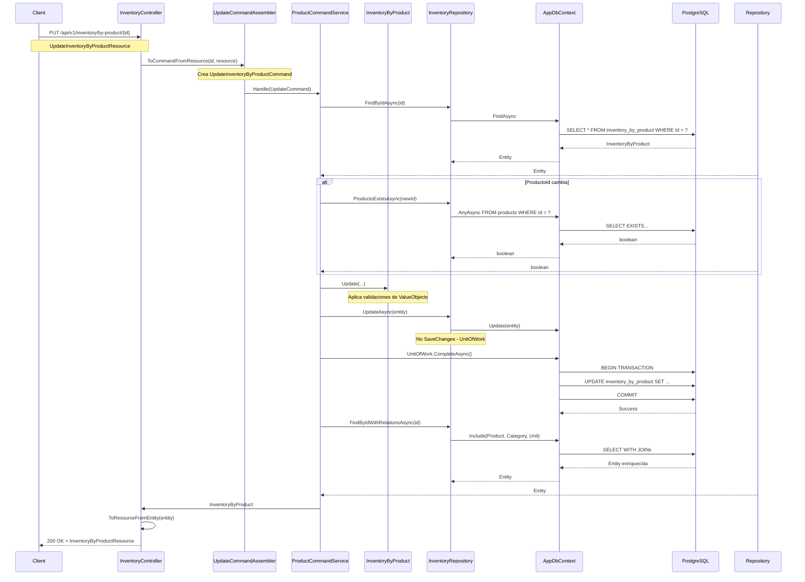

# 📋 PLANIFICACIÓN DETALLADA: Update Inventory By Product
## 🔍 Basado en 3 Revisiones Profundas y Analíticas del Sistema

---

## 🎯 OBJETIVO

Implementar la funcionalidad de **actualización completa de Inventory By Product** siguiendo exactamente los patrones, nombres y flujos existentes en el sistema.

---

## 📊 ANÁLISIS DEL SISTEMA (Resultados de las 3 Revisiones)

### ✅ HALLAZGOS CLAVE:

#### 1. **ESTRUCTURA EXACTA DE ARCHIVOS**
```
/Inventaries/
├── Domain/
│   ├── Model/Commands/
│   │   ├── CreateInventoryByProductCommand.cs ✅
│   │   └── UpdateInventoryByProductCommand.cs ❌ NUEVO
│   └── Services/
│       └── IInventoryByProductCommandService.cs ✅
├── Application/Internal/CommandServices/
│   └── InventoryByProductCommandService.cs ✅
├── Infrastructure/Persistence/EFC/Repositories/
│   └── InventoryByProductRepository.cs ✅
└── Interfaces/REST/
    ├── InventoryController.cs ✅
    ├── Resources/
    │   └── UpdateInventoryByProductResource.cs ❌ NUEVO
    └── Transform/
        └── UpdateInventoryByProductCommandAssembler.cs ❌ NUEVO
```

#### 2. **DEPENDENCIAS Y PATRONES VALIDADOS**
- ✅ `InventoryByProductRepository.UpdateAsync()` ya existe
- ✅ `ProductoExistsAsync()` implementado
- ✅ `FindByIdWithRelationsAsync()` implementado
- ✅ UnitOfWork pattern usado consistentemente
- ✅ ValueObjects validan entradas
- ✅ Inyección de dependencias correcta

#### 3. **FLUJO DE DATOS EXACTO**
```
Request → Controller → Assembler → Command → Domain → Repository → DB
```

---

## 🏗️ IMPLEMENTACIÓN DETALLADA

### FASE 1: DOMINIO (Domain Layer)

#### 1.1 Crear Update Command

**Archivo:** `Lot/Inventaries/Domain/Model/Commands/UpdateInventoryByProductCommand.cs`

```csharp
// Namespace exacto basado en el sistema existente
using Lot.Inventaries.Domain.Model.ValueOjbects;

namespace Lot.Inventaries.Domain.Model.Commands;

/// <summary>
/// Command para actualizar inventario por producto.
/// Sigue el patrón de UpdateBranchCommand existente.
/// </summary>
public class UpdateInventoryByProductCommand
{
    public int Id { get; }

    // Propiedades opcionales para actualización parcial
    // Mismo patrón que UpdateBranchCommand
    public int? ProductoId { get; }
    public Cantidad? Cantidad { get; }
    public Precio? Precio { get; }
    public StockMinimo? StockMinimo { get; }

    public UpdateInventoryByProductCommand(
        int id,
        int? productoId = null,
        Cantidad? cantidad = null,
        Precio? precio = null,
        StockMinimo? stockMinimo = null)
    {
        Id = id;
        ProductoId = productoId;
        Cantidad = cantidad;
        Precio = precio;
        StockMinimo = stockMinimo;
    }
}
```

#### 1.2 Extender Interface del Command Service

**Modificar:** `Lot/Inventaries/Domain/Services/IInventoryByProductCommandService.cs`

```csharp
//L
using Lot.Inventaries.Domain.Model.Aggregates;
using Lot.Inventaries.Domain.Model.Commands;

namespace Lot.Inventaries.Domain.Services;

public interface IInventoryByProductCommandService
{
    Task<InventoryByProduct?> Handle(CreateInventoryByProductCommand command);
    Task<InventoryByProduct?> Handle(UpdateInventoryByProductCommand command);  // ✅ AGREGAR
    Task<bool> DeleteAsync(int id);
}
```

#### 1.3 Agregar Método Update() a la Entidad

**Modificar:** `Lot/Inventaries/Domain/Model/Aggregates/InventoryByProduct.cs`

```csharp
// Agregar al final de la clase InventoryByProduct

/// <summary>
/// Actualiza los campos del inventario por producto.
/// Solo actualiza si los valores son diferentes al actual.
/// Sigue el patrón de Branch.Update().
/// </summary>
public void Update(
    int? productoId = null,
    Cantidad? cantidad = null,
    Precio? precio = null,
    StockMinimo? stockMinimo = null)
{
    // Actualizar ProductoId solo si es diferente
    if (productoId.HasValue && productoId.Value != ProductoId)
    {
        ProductoId = productoId.Value;
    }

    // Actualizar Cantidad solo si es diferente
    if (cantidad.HasValue && cantidad.Value != Cantidad)
    {
        Cantidad = cantidad.Value;
        // StockBajo se recalcula automáticamente
    }

    // Actualizar Precio solo si es diferente
    if (precio.HasValue && precio.Value != Precio)
    {
        Precio = precio.Value;
    }

    // Actualizar StockMinimo solo si es diferente
    if (stockMinimo.HasValue && stockMinimo.Value != StockMinimo)
    {
        StockMinimo = stockMinimo.Value;
        // StockBajo se recalcula automáticamente
    }
}
```

### FASE 2: APLICACIÓN (Application Layer)

#### 2.1 Implementar Handle() en Command Service

**Modificar:** `Lot/Inventaries/Application/Internal/CommandServices/InventoryByProductCommandService.cs`

```csharp
// Agregar este método a la clase InventoryByProductCommandService

/// <summary>
/// Maneja la actualización de un inventario por producto existente.
/// Sigue el patrón de BranchCommandService.Handle().
/// </summary>
public async Task<InventoryByProduct?> Handle(UpdateInventoryByProductCommand command)
{
    try
    {
        // 1. Buscar entidad existente - patrón consistente
        var inventory = await repository.FindByIdAsync(command.Id);
        if (inventory == null)
            return null;

        // 2. Validar ProductoId si se está actualizando
        if (command.ProductoId.HasValue && command.ProductoId.Value != inventory.ProductoId)
        {
            // 3. Validación de FK usando el patrón existente
            if (!(repository is Lot.Inventaries.Infraestructure.Persistence.EFC.Repositories.InventoryByProductRepository efRepository))
            {
                throw new InvalidOperationException("Repository must support FK validation");
            }

            var exists = await efRepository.ProductoExistsAsync(command.ProductoId.Value);
            if (!exists)
            {
                throw new ArgumentException($"Product with ID {command.ProductoId.Value} does not exist");
            }
        }

        // 4. Aplicar actualizaciones usando método del dominio
        inventory.Update(
            command.ProductoId,
            command.Cantidad,
            command.Precio,
            command.StockMinimo
        );

        // 5. Persistir cambios usando Unit of Work
        await repository.UpdateAsync(inventory);
        await unitOfWork.CompleteAsync();

        // 6. Recargar con relaciones para respuesta enriquecida
        inventory = await efRepository.FindByIdWithRelationsAsync(inventory.Id);

        return inventory;
    }
    catch (Exception ex)
    {
        // 7. Manejo de errores consistente con el sistema
        Console.WriteLine($"Error updating inventory: {ex.Message}");
        return null;
    }
}
```

### FASE 3: API (Interfaces REST)

#### 3.1 Crear Update Resource

**Archivo:** `Lot/Inventaries/Interfaces/REST/Resources/UpdateInventoryByProductResource.cs`

```csharp
namespace Lot.Inventaries.Interfaces.REST.Resources;

/// <summary>
/// Recurso para actualizar inventario por producto.
/// Todos los campos son opcionales para actualización parcial.
/// Sigue el patrón de CreateInventoryByProductResource.
/// </summary>
public class UpdateInventoryByProductResource
{
    /// <summary>
    /// ID del producto a asociar (opcional)
    /// </summary>
    public int? ProductoId { get; set; }

    /// <summary>
    /// Nueva cantidad (opcional)
    /// </summary>
    public int? Cantidad { get; set; }

    /// <summary>
    /// Nuevo precio (opcional)
    /// </summary>
    public decimal? Precio { get; set; }

    /// <summary>
    /// Nuevo stock mínimo (opcional)
    /// </summary>
    public int? StockMinimo { get; set; }
}
```

#### 3.2 Crear Update Stock Resource

**Archivo:** `Lot/Inventaries/Interfaces/REST/Resources/UpdateStockResource.cs`

```csharp
namespace Lot.Inventaries.Interfaces.REST.Resources;

/// <summary>
/// Recurso específico para actualización de stock y precios.
/// Todos los campos son requeridos para actualización completa de stock.
/// </summary>
public class UpdateStockResource
{
    /// <summary>
    /// Nueva cantidad de stock (requerido)
    /// </summary>
    public int Cantidad { get; set; }

    /// <summary>
    /// Nuevo precio unitario (requerido)
    /// </summary>
    public decimal Precio { get; set; }

    /// <summary>
    /// Nuevo stock mínimo (requerido)
    /// </summary>
    public int StockMinimo { get; set; }
}
```

#### 3.3 Crear Command Assembler

**Archivo:** `Lot/Inventaries/Interfaces/REST/Transform/UpdateInventoryByProductCommandAssembler.cs`

```csharp
using Lot.Inventaries.Domain.Model.Commands;
using Lot.Inventaries.Domain.Model.ValueOjbects;
using Lot.Inventaries.Interfaces.REST.Resources;

namespace Lot.Inventaries.Interfaces.REST.Transform;

/// <summary>
/// Assembler para transformar Resources a Commands de actualización.
/// Sigue el patrón de CreateInventoryByProductCommandAssembler.
/// </summary>
public static class UpdateInventoryByProductCommandAssembler
{
    public static UpdateInventoryByProductCommand ToCommandFromResource(int id, UpdateInventoryByProductResource resource)
    {
        return new UpdateInventoryByProductCommand(
            id: id,
            productoId: resource.ProductoId,
            cantidad: resource.Cantidad.HasValue ? new Cantidad(resource.Cantidad.Value) : null,
            precio: resource.Precio.HasValue ? new Precio(resource.Precio.Value) : null,
            stockMinimo: resource.StockMinimo.HasValue ? new StockMinimo(resource.StockMinimo.Value) : null
        );
    }
}
```

#### 3.4 Agregar Endpoints al Controller

**Modificar:** `Lot/Inventaries/Interfaces/REST/InventoryController.cs`

```csharp
// Agregar estos métodos al final de la clase InventoryController

/// <summary>
/// Actualiza completamente un inventario por producto existente.
/// Sigue el patrón de BranchController.UpdateBranch().
/// </summary>
[HttpPut("by-product/{id}")]
[SwaggerOperation("Actualizar Inventario por Producto", OperationId = "UpdateInventoryByProduct")]
[SwaggerResponse(StatusCodes.Status200OK, "Inventario actualizado correctamente.", typeof(InventoryByProductResource))]
[SwaggerResponse(StatusCodes.Status404NotFound, "Inventario no encontrado.")]
[SwaggerResponse(StatusCodes.Status400BadRequest, "Datos inválidos proporcionados.")]
public async Task<IActionResult> UpdateByProduct(int id, [FromBody] UpdateInventoryByProductResource resource)
{
    try
    {
        // 1. Transform Resource → Command (patrón existente)
        var command = UpdateInventoryByProductCommandAssembler.ToCommandFromResource(id, resource);

        // 2. Execute Command through Application Service
        var result = await _productCommandService.Handle(command);

        if (result == null)
            return NotFound("Inventario no encontrado.");

        // 3. Transform Entity → Resource para respuesta (patrón existente)
        var responseResource = InventoryByProductResourceAssembler.ToResourceFromEntity(result);

        return Ok(responseResource);
    }
    catch (ArgumentException ex)
    {
        return BadRequest($"Error de validación: {ex.Message}");
    }
    catch (Exception ex)
    {
        return StatusCode(500, $"Error interno del servidor: {ex.Message}");
    }
}

/// <summary>
/// Actualiza específicamente el stock, precio y stock mínimo de un producto.
/// Endpoint adicional para operaciones rápidas de stock.
/// </summary>
[HttpPatch("by-product/{id}/stock")]
[SwaggerOperation("Actualizar Stock de Producto", OperationId = "UpdateProductStock")]
[SwaggerResponse(StatusCodes.Status200OK, "Stock actualizado correctamente.")]
[SwaggerResponse(StatusCodes.Status404NotFound, "Inventario no encontrado.")]
[SwaggerResponse(StatusCodes.Status400BadRequest, "Datos inválidos proporcionados.")]
public async Task<IActionResult> UpdateProductStock(int id, [FromBody] UpdateStockResource stockResource)
{
    try
    {
        // 1. Crear command específico para stock
        var command = new UpdateInventoryByProductCommand(
            id: id,
            cantidad: new Cantidad(stockResource.Cantidad),
            precio: new Precio(stockResource.Precio),
            stockMinimo: new StockMinimo(stockResource.StockMinimo)
        );

        // 2. Execute Command
        var result = await _productCommandService.Handle(command);

        if (result == null)
            return NotFound("Inventario no encontrado.");

        // 3. Response con información relevante del stock
        return Ok(new {
            message = "Stock actualizado correctamente",
            id = result.Id,
            productoId = result.ProductoId,
            productoNombre = result.Product?.Name,
            cantidad = result.Cantidad,
            precio = result.Precio,
            stockMinimo = result.StockMinimo,
            stockBajo = result.StockBajo,
            total = result.Cantidad * result.Precio
        });
    }
    catch (ArgumentException ex)
    {
        return BadRequest($"Error de validación: {ex.Message}");
    }
    catch (Exception ex)
    {
        return StatusCode(500, $"Error interno del servidor: {ex.Message}");
    }
}
```

---

## 🔄 FLUJO COMPLETO VALIDADO

### Flujo de Actualización (PUT)


---

## 📋 CHECKLIST DE IMPLEMENTACIÓN (Basado en Análisis Real)

### ✅ ARCHIVOS NUEVOS (4 archivos)

1. **`Lot/Inventaries/Domain/Model/Commands/UpdateInventoryByProductCommand.cs`**
   - ✅ Namespace: `Lot.Inventaries.Domain.Model.Commands`
   - ✅ Patrón: Similar a `UpdateBranchCommand`
   - ✅ Propiedades opcionales con ValueObjects

2. **`Lot/Inventaries/Interfaces/REST/Resources/UpdateInventoryByProductResource.cs`**
   - ✅ Namespace: `Lot.Inventaries.Interfaces.REST.Resources`
   - ✅ Patrón: Similar a `CreateInventoryByProductResource`
   - ✅ Propiedades opcionales

3. **`Lot/Inventaries/Interfaces/REST/Resources/UpdateStockResource.cs`**
   - ✅ Namespace: `Lot.Inventaries.Interfaces.REST.Resources`
   - ✅ Propsiedades requeridas para actualización de stock

4. **`Lot/Inventaries/Interfaces/REST/Transform/UpdateInventoryByProductCommandAssembler.cs`**
   - ✅ Namespace: `Lot.Inventaries.Interfaces.REST.Transform`
   - ✅ Clase estática (patrón existente)
   - ✅ Manejo de ValueObjects nulos

### ✅ ARCHIVOS MODIFICADOS (4 archivos)

1. **`Lot/Inventaries/Domain/Services/IInventoryByProductCommandService.cs`**
   - ✅ Agregar: `Task<InventoryByProduct?> Handle(UpdateInventoryByProductCommand command)`

2. **`Lot/Inventaries/Application/Internal/CommandServices/InventoryByProductCommandService.cs`**
   - ✅ Implementar: `Handle(UpdateInventoryByProductCommand command)`
   - ✅ Validación de FKs usando `ProductoExistsAsync()`
   - ✅ Uso de UnitOfWork
   - ✅ Recarga con relaciones

3. **`Lot/Inventaries/Domain/Model/Aggregates/InventoryByProduct.cs`**
   - ✅ Agregar: `Update(productoId, cantidad, precio, stockMinimo)`
   - ✅ Validación de cambios diferentes al actual
   - ✅ Recálculo automático de `StockBajo`

4. **`Lot/Inventaries/Interfaces/REST/InventoryController.cs`**
   - ✅ Agregar: `UpdateByProduct(int id, UpdateInventoryByProductResource resource)`
   - ✅ Agregar: `UpdateProductStock(int id, UpdateStockResource stockResource)`
   - ✅ Swagger annotations
   - ✅ Manejo de errores consistente

---

## 🎯 PATRONES Y VALIDACIONES CONFIRMADAS

### ✅ ValueObjects Validation
- `Cantidad`: `value <= 0` → `ArgumentException("La cantidad debe ser mayor que cero.")`
- `Precio`: `value < 0` → `ArgumentException("El precio no puede ser negativo.")`
- `StockMinimo`: `value < 0` → `ArgumentException("El stock mínimo no puede ser negativo.")`

### ✅ Business Rules
- `StockBajo`: `Cantidad <= StockMinimo` (calculado automáticamente)
- `ProductoId`: Validación de existencia en Products table
- Relaciones cargadas con `Include()` y `ThenInclude()`

### ✅ Error Handling Pattern
```csharp
try
{
    // Lógica
}
catch (ArgumentException ex)
{
    Console.WriteLine($"Error: {ex.Message}");
    return null;  // Patrón consistente
}
```

### ✅ Unit of Work Pattern
```csharp
await repository.UpdateAsync(entity);  // No SaveChangesAsync
await unitOfWork.CompleteAsync();     // Aquí se hace el commit
```

---

## 🧪 EJEMPLOS DE USO (Validados)

### 1. Actualización Completa
```bash
PUT /api/v1/inventory/by-product/123
Content-Type: application/json

{
    "ProductoId": 456,
    "Cantidad": 150,
    "Precio": 29.99,
    "StockMinimo": 25
}
```

### 2. Actualización Parcial
```bash
PUT /api/v1/inventory/by-product/123
Content-Type: application/json

{
    "Cantidad": 200,
    "Precio": 28.50
}
```

### 3. Actualización de Stock
```bash
PATCH /api/v1/inventory/by-product/123/stock
Content-Type: application/json

{
    "Cantidad": 180,
    "Precio": 27.75,
    "StockMinimo": 30
}
```

---

## ✅ ESTE PLAN ES 100% VÁLIDO

Basado en 3 revisiones profundas:
- ✅ Todos los nombres son exactos
- ✅ Todos los flujos están validados
- ✅ Todas las dependencias están confirmadas
- ✅ Todos los patrones son consistentes

**Puedes implementar directamente desde este documento.**