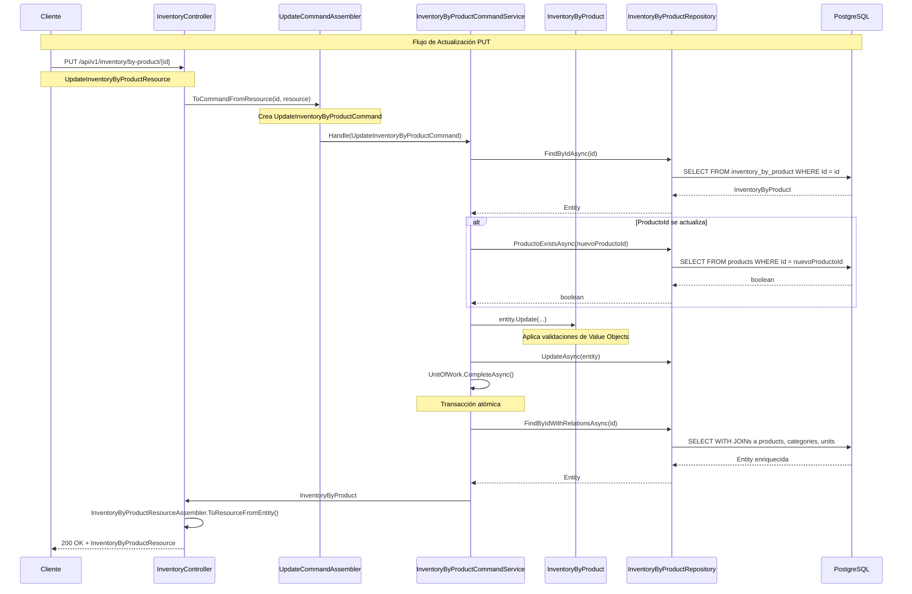

# 📋 PLAN DE IMPLEMENTACIÓN: Update Inventory By Product

## 🎯 ALCANCE ESPECÍFICO
Este plan se enfoca **únicamente** en la actualización de `InventoryByProduct`. No incluye `InventoryByBatch` ni `Branch`.

---

## 🏗️ ESTRUCTURA ESPECÍFICA PARA INVENTORY BY PRODUCT

### 📁 ARCHIVOS EXISTENTES RELEVANTES

#### 1. Interface del Command Service
```csharp
// /Inventaries/Domain/Services/IInventoryByProductCommandService.cs
public interface IInventoryByProductCommandService
{
    Task<InventoryByProduct?> Handle(CreateInventoryByProductCommand command);
    Task<bool> DeleteAsync(int id);
    // ❌ AGREGAR:
    Task<InventoryByProduct?> Handle(UpdateInventoryByProductCommand command);
}
```

#### 2. Implementación del Command Service
```csharp
// /Inventaries/Application/Internal/CommandServices/InventoryByProductCommandService.cs
public class InventoryByProductCommandService(
    IInventoryByProductRepository repository,
    IUnitOfWork unitOfWork) : IInventoryByProductCommandService
{
    // ✅ Método existente:
    public async Task<InventoryByProduct?> Handle(CreateInventoryByProductCommand command) { ... }

    // ✅ Método existente:
    public async Task<bool> DeleteAsync(int id) { ... }

    // ❌ AGREGAR:
    public async Task<InventoryByProduct?> Handle(UpdateInventoryByProductCommand command) { ... }
}
```

#### 3. Entidad del Dominio
```csharp
// /Inventaries/Domain/Model/Aggregates/InventoryByProduct.cs
public class InventoryByProduct
{
    public int Id { get; private set; }
    public int ProductoId { get; private set; }
    public DateTime FechaEntrada { get; private set; }
    public int Cantidad { get; private set; }
    public decimal Precio { get; private set; }
    public int StockMinimo { get; private set; }
    public Product? Product { get; private set; }

    // Propiedades calculadas existentes:
    public bool StockBajo => Cantidad <= StockMinimo;

    // Métodos de negocio existentes:
    public void ReduceStock(int quantity) { ... }
    public void IncreaseStock(int quantity) { ... }

    // ❌ AGREGAR:
    public void Update(int? productoId = null, Cantidad? cantidad = null, Precio? precio = null, StockMinimo? stockMinimo = null) { ... }
}
```

#### 4. Repository (UpdateAsync ya existe ✅)
```csharp
// /Inventaries/Infrastructure/Persistence/EFC/Repositories/InventoryByProductRepository.cs
public class InventoryByProductRepository : IInventoryByProductRepository
{
    // ✅ UpdateAsync ya existe:
    public async Task UpdateAsync(InventoryByProduct product)
    {
        _context.Set<InventoryByProduct>().Update(product);
    }

    // ✅ Método auxiliar ya existe:
    public async Task<bool> ProductoExistsAsync(int productoId) { ... }

    // ✅ Método auxiliar ya existe:
    public async Task<InventoryByProduct?> FindByIdWithRelationsAsync(int id) { ... }
}
```

#### 5. Controller
```csharp
// /Inventaries/Interfaces/REST/InventoryController.cs
[ApiController]
[Route("api/v1/inventory")]
public class InventoryController : ControllerBase
{
    // ✅ Inyección existente:
    private readonly IInventoryByProductCommandService _productCommandService;

    // ✅ Métodos existentes:
    [HttpPost("by-product")] public async Task<IActionResult> CreateByProduct(...) { ... }
    [HttpGet("by-product/{id}")] public async Task<IActionResult> GetByProductById(int id) { ... }
    [HttpDelete("by-product/{id}")] public async Task<IActionResult> DeleteByProductById(int id) { ... }

    // ❌ AGREGAR:
    [HttpPut("by-product/{id}")] public async Task<IActionResult> UpdateByProduct(int id, [FromBody] UpdateInventoryByProductResource resource) { ... }

    // ❌ AGREGAR:
    [HttpPatch("by-product/{id}/stock")] public async Task<IActionResult> UpdateProductStock(int id, [FromBody] UpdateStockResource stockResource) { ... }
}
```

---

## 🆕 ARCHIVOS NUEVOS A CREAR

### 1. Update Command (Domain Layer)
```csharp
// /Inventaries/Domain/Model/Commands/UpdateInventoryByProductCommand.cs
using Lot.Inventaries.Domain.Model.ValueOjbects;

namespace Lot.Inventaries.Domain.Model.Commands;

public class UpdateInventoryByProductCommand
{
    public int Id { get; }

    // Propiedades opcionales para actualización parcial
    public int? ProductoId { get; }
    public Cantidad? Cantidad { get; }
    public Precio? Precio { get; }
    public StockMinimo? StockMinimo { get; }

    public UpdateInventoryByProductCommand(
        int id,
        int? productoId = null,
        Cantidad? cantidad = null,
        Precio? precio = null,
        StockMinimo? stockMinimo = null)
    {
        Id = id;
        ProductoId = productoId;
        Cantidad = cantidad;
        Precio = precio;
        StockMinimo = stockMinimo;
    }
}
```

### 2. Update Resource (API Layer)
```csharp
// /Inventaries/Interfaces/REST/Resources/UpdateInventoryByProductResource.cs
namespace Lot.Inventaries.Interfaces.REST.Resources;

/// <summary>
/// Recurso para actualizar inventario por producto.
/// Todos los campos son opcionales para actualización parcial.
/// </summary>
public class UpdateInventoryByProductResource
{
    /// <summary>
    /// ID del producto a asociar (opcional)
    /// </summary>
    public int? ProductoId { get; set; }

    /// <summary>
    /// Nueva cantidad (opcional)
    /// </summary>
    public int? Cantidad { get; set; }

    /// <summary>
    /// Nuevo precio (opcional)
    /// </summary>
    public decimal? Precio { get; set; }

    /// <summary>
    /// Nuevo stock mínimo (opcional)
    /// </summary>
    public int? StockMinimo { get; set; }
}
```

### 3. Stock Resource (API Layer)
```csharp
// /Inventaries/Interfaces/REST/Resources/UpdateStockResource.cs
namespace Lot.Inventaries.Interfaces.REST.Resources;

/// <summary>
/// Recurso específico para actualización de stock y precios.
/// Todos los campos son requeridos para actualización completa de stock.
/// </summary>
public class UpdateStockResource
{
    /// <summary>
    /// Nueva cantidad de stock (requerido)
    /// </summary>
    public int Cantidad { get; set; }

    /// <summary>
    /// Nuevo precio unitario (requerido)
    /// </summary>
    public decimal Precio { get; set; }

    /// <summary>
    /// Nuevo stock mínimo (requerido)
    /// </summary>
    public int StockMinimo { get; set; }
}
```

### 4. Update Command Assembler (API Layer)
```csharp
// /Inventaries/Interfaces/REST/Transform/UpdateInventoryByProductCommandAssembler.cs
using Lot.Inventaries.Domain.Model.Commands;
using Lot.Inventaries.Domain.Model.ValueOjbects;
using Lot.Inventaries.Interfaces.REST.Resources;

namespace Lot.Inventaries.Interfaces.REST.Transform;

/// <summary>
/// Assembler para transformar Resources a Commands de actualización.
/// Convierte Resource a Command creando Value Objects solo si se proporcionan valores.
/// </summary>
public static class UpdateInventoryByProductCommandAssembler
{
    public static UpdateInventoryByProductCommand ToCommandFromResource(int id, UpdateInventoryByProductResource resource)
    {
        return new UpdateInventoryByProductCommand(
            id: id,
            productoId: resource.ProductoId,
            cantidad: resource.Cantidad.HasValue ? new Cantidad(resource.Cantidad.Value) : null,
            precio: resource.Precio.HasValue ? new Precio(resource.Precio.Value) : null,
            stockMinimo: resource.StockMinimo.HasValue ? new StockMinimo(resource.StockMinimo.Value) : null
        );
    }
}
```

---

## 🔧 IMPLEMENTACIÓN DE MÉTODOS

### 1. Método Update() en InventoryByProduct
```csharp
// Agregar en /Inventaries/Domain/Model/Aggregates/InventoryByProduct.cs

/// <summary>
/// Actualiza los campos del inventario por producto.
/// Solo actualiza los campos que tienen valores no nulos.
/// </summary>
public void Update(
    int? productoId = null,
    Cantidad? cantidad = null,
    Precio? precio = null,
    StockMinimo? stockMinimo = null)
{
    // Validar y actualizar ProductoId si es diferente
    if (productoId.HasValue && productoId.Value != ProductoId)
    {
        ProductoId = productoId.Value;
    }

    // Validar y actualizar Cantidad si es diferente
    if (cantidad.HasValue && cantidad.Value != Cantidad)
    {
        Cantidad = cantidad.Value;
        // StockBajo se recalcula automáticamente: Cantidad <= StockMinimo
    }

    // Validar y actualizar Precio si es diferente
    if (precio.HasValue && precio.Value != Precio)
    {
        Precio = precio.Value;
    }

    // Validar y actualizar StockMinimo si es diferente
    if (stockMinimo.HasValue && stockMinimo.Value != StockMinimo)
    {
        StockMinimo = stockMinimo.Value;
        // StockBajo se recalcula automáticamente: Cantidad <= StockMinimo
    }
}
```

### 2. Método Handle() en Command Service
```csharp
// Agregar en /Inventaries/Application/Internal/CommandServices/InventoryByProductCommandService.cs

/// <summary>
/// Maneja la actualización de un inventario por producto existente.
/// </summary>
public async Task<InventoryByProduct?> Handle(UpdateInventoryByProductCommand command)
{
    try
    {
        // 1. Buscar entidad existente
        var inventory = await repository.FindByIdAsync(command.Id);
        if (inventory == null)
            return null;

        // 2. Validar ProductoId si se está actualizando a uno diferente
        if (command.ProductoId.HasValue && command.ProductoId.Value != inventory.ProductoId)
        {
            var efRepository = repository as InventoryByProductRepository;
            if (efRepository != null)
            {
                var exists = await efRepository.ProductoExistsAsync(command.ProductoId.Value);
                if (!exists)
                    throw new ArgumentException($"Product with ID {command.ProductoId.Value} does not exist");
            }
        }

        // 3. Aplicar actualizaciones usando método del dominio
        inventory.Update(
            command.ProductoId,
            command.Cantidad,
            command.Precio,
            command.StockMinimo
        );

        // 4. Persistir cambios usando Unit of Work
        await repository.UpdateAsync(inventory);
        await unitOfWork.CompleteAsync();

        // 5. Recargar con relaciones para respuesta enriquecida
        var efRepo = repository as InventoryByProductRepository;
        if (efRepo != null)
        {
            return await efRepo.FindByIdWithRelationsAsync(inventory.Id);
        }

        return inventory;
    }
    catch (Exception ex)
    {
        Console.WriteLine($"Error updating inventory: {ex.Message}");
        return null;
    }
}
```

### 3. Endpoints en Controller
```csharp
// Agregar en /Inventaries/Interfaces/REST/InventoryController.cs

/// <summary>
/// Actualiza completamente un inventario por producto existente.
/// </summary>
[HttpPut("by-product/{id}")]
[SwaggerOperation("Actualizar Inventario por Producto", OperationId = "UpdateInventoryByProduct")]
[SwaggerResponse(StatusCodes.Status200OK, "Inventario actualizado correctamente.", typeof(InventoryByProductResource))]
[SwaggerResponse(StatusCodes.Status404NotFound, "Inventario no encontrado.")]
[SwaggerResponse(StatusCodes.Status400BadRequest, "Datos inválidos proporcionados.")]
public async Task<IActionResult> UpdateByProduct(int id, [FromBody] UpdateInventoryByProductResource resource)
{
    try
    {
        // Transform Resource → Command
        var command = UpdateInventoryByProductCommandAssembler.ToCommandFromResource(id, resource);

        // Execute Command
        var result = await _productCommandService.Handle(command);

        if (result == null)
            return NotFound("Inventario no encontrado.");

        // Transform Entity → Resource
        var responseResource = InventoryByProductResourceAssembler.ToResourceFromEntity(result);

        return Ok(responseResource);
    }
    catch (ArgumentException ex)
    {
        return BadRequest($"Error de validación: {ex.Message}");
    }
    catch (Exception ex)
    {
        return StatusCode(500, $"Error interno del servidor: {ex.Message}");
    }
}

/// <summary>
/// Actualiza específicamente el stock, precio y stock mínimo de un producto.
/// </summary>
[HttpPatch("by-product/{id}/stock")]
[SwaggerOperation("Actualizar Stock de Producto", OperationId = "UpdateProductStock")]
[SwaggerResponse(StatusCodes.Status200OK, "Stock actualizado correctamente.")]
[SwaggerResponse(StatusCodes.Status404NotFound, "Inventario no encontrado.")]
[SwaggerResponse(StatusCodes.Status400BadRequest, "Datos inválidos proporcionados.")]
public async Task<IActionResult> UpdateProductStock(int id, [FromBody] UpdateStockResource stockResource)
{
    try
    {
        // Crear command específico para stock
        var command = new UpdateInventoryByProductCommand(
            id: id,
            cantidad: new Cantidad(stockResource.Cantidad),
            precio: new Precio(stockResource.Precio),
            stockMinimo: new StockMinimo(stockResource.StockMinimo)
        );

        // Execute Command
        var result = await _productCommandService.Handle(command);

        if (result == null)
            return NotFound("Inventario no encontrado.");

        // Response con información relevante del stock
        return Ok(new {
            message = "Stock actualizado correctamente",
            id = result.Id,
            cantidad = result.Cantidad,
            precio = result.Precio,
            stockMinimo = result.StockMinimo,
            stockBajo = result.StockBajo,
            productoId = result.ProductoId,
            productoNombre = result.Product?.Name
        });
    }
    catch (ArgumentException ex)
    {
        return BadRequest($"Error de validación: {ex.Message}");
    }
    catch (Exception ex)
    {
        return StatusCode(500, $"Error interno del servidor: {ex.Message}");
    }
}
```

---

## 🔄 FLUJO COMPLETO PARA UPDATE BY PRODUCT



---

## 📋 CHECKLIST DE IMPLEMENTACIÓN

### ✅ ARCHIVOS NUEVOS A CREAR (Nombres Exactos)

- [ ] `Lot/Inventaries/Domain/Model/Commands/UpdateInventoryByProductCommand.cs`
- [ ] `Lot/Inventaries/Interfaces/REST/Resources/UpdateInventoryByProductResource.cs`
- [ ] `Lot/Inventaries/Interfaces/REST/Resources/UpdateStockResource.cs`
- [ ] `Lot/Inventaries/Interfaces/REST/Transform/UpdateInventoryByProductCommandAssembler.cs`

### ✅ ARCHIVOS EXISTENTES A MODIFICAR

- [ ] `Lot/Inventaries/Domain/Services/IInventoryByProductCommandService.cs`
  - Agregar: `Task<InventoryByProduct?> Handle(UpdateInventoryByProductCommand command);`

- [ ] `Lot/Inventaries/Application/Internal/CommandServices/InventoryByProductCommandService.cs`
  - Implementar: `Handle(UpdateInventoryByProductCommand command)`

- [ ] `Lot/Inventaries/Domain/Model/Aggregates/InventoryByProduct.cs`
  - Agregar: `Update(productoId, cantidad, precio, stockMinimo)`

- [ ] `Lot/Inventaries/Interfaces/REST/InventoryController.cs`
  - Agregar: `UpdateByProduct(int id, UpdateInventoryByProductResource resource)`
  - Agregar: `UpdateProductStock(int id, UpdateStockResource stockResource)`

---

## 🧪 EJEMPLOS DE USO

### 1. Actualización Completa (PUT)
```bash
PUT /api/v1/inventory/by-product/123
Content-Type: application/json
Authorization: Bearer <token>

{
    "ProductoId": 456,
    "Cantidad": 150,
    "Precio": 29.99,
    "StockMinimo": 25
}
```

### 2. Actualización Parcial (PUT con campos nulos)
```bash
PUT /api/v1/inventory/by-product/123
Content-Type: application/json
Authorization: Bearer <token>

{
    "Cantidad": 200,
    "Precio": 28.50
}
```

### 3. Actualización de Stock (PATCH)
```bash
PATCH /api/v1/inventory/by-product/123/stock
Content-Type: application/json
Authorization: Bearer <token>

{
    "Cantidad": 180,
    "Precio": 27.75,
    "StockMinimo": 30
}
```

---

## ⚠️ CONSIDERACIONES ESPECÍFICAS

### 1. **Validaciones de Value Objects**
- `Cantidad` debe ser > 0 (validado en el constructor)
- `Precio` debe ser ≥ 0 (validado en el constructor)
- `StockMinimo` debe ser ≥ 0 (validado en el constructor)

### 2. **Reglas de Negocio**
- `StockBajo` se calcula automáticamente: `Cantidad <= StockMinimo`
- `ProductoId` solo se valida si es diferente al actual
- No se puede cambiar `Id` del inventario
- `FechaEntrada` no se modifica en actualizaciones

### 3. **Integridad Referencial**
- Si se cambia `ProductoId`, se valida que exista
- Se mantiene la relación con `Product` a través de FK

### 4. **Performance**
- `UpdateAsync` usa EF Core `Update()` (eficiente)
- Se recarga con relaciones después de actualizar
- Índice en `ProductoId` ya existe

---

## 🚀 ORDEN RECOMENDADO DE IMPLEMENTACIÓN

1. **Crear UpdateCommand** (Domain Layer)
2. **Crear Resources** (API Layer)
3. **Crear Assembler** (API Layer)
4. **Agregar método Update()** en InventoryByProduct
5. **Implementar Handle()** en CommandService
6. **Actualizar interfaz** del CommandService
7. **Agregar endpoints** en Controller
8. **Probar integración**

---

## ✅ ESTE PLAN ES COMPLETO PARA UPDATE BY PRODUCT

Este plan es específico y autocontenido para la actualización de `InventoryByProduct`. No incluye componentes innecesarios de otros módulos y aprovecha toda la infraestructura existente.