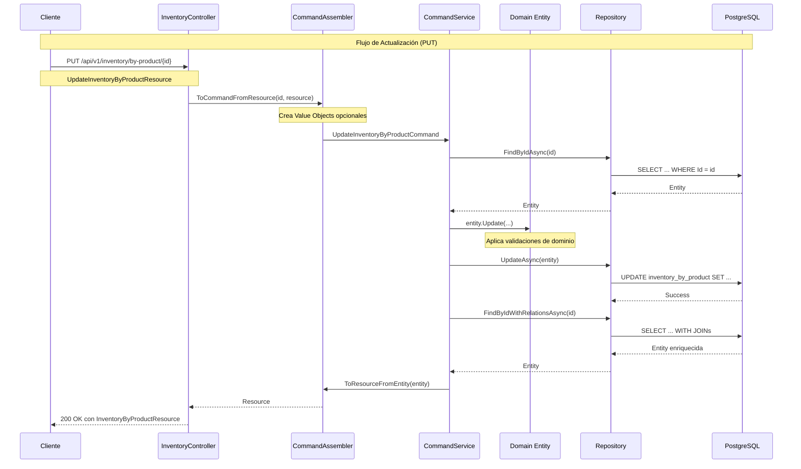

# Plan de Implementación: Update Inventory Endpoints
## 📋 ENFOQUE: CÓDIGO PURO - SIN TESTING

## Tabla de Contenidos
- [Análisis del Estado Actual](#análisis-del-estado-actual)
- [Cambios Requeridos](#cambios-requeridos)
- [Plan de Implementación por Capa](#plan-de-implementación-por-capa)
- [Diagrama de Implementación](#diagrama-de-implementación)
- [Consideraciones Técnicas](#consideraciones-técnicas)
- [Casos de Uso](#casos-de-uso)

---

## Análisis del Estado Actual

### ✅ Patrones Identificados en el Código Existente

#### 1. **Patrón de Actualización en Branch**
El módulo de Branch ya implementa un patrón completo de actualización:

```csharp
// Command existente
public class UpdateBranchCommand
{
    public int Id { get; }
    public string? Name { get; }
    public string? Type { get; }
    // ... propiedades opcionales
}

// Command Service
public async Task<Branch?> Handle(UpdateBranchCommand command)
{
    var branch = await repository.FindByIdAsync(command.Id);
    if (branch == null) return null;

    branch.Update(command.Name, command.Type, ...);
    await repository.UpdateAsync(branch);
    await unitOfWork.CompleteAsync();
    return branch;
}

// Controller
[HttpPut("{id}")]
public async Task<IActionResult> UpdateBranch(int id, [FromBody] CreateBranchResource resource)
{
    var command = new UpdateBranchCommand(id, resource.Name, ...);
    var result = await _commandService.Handle(command);
    if (result == null) return NotFound();
    return Ok(BranchResourceAssembler.ToResource(result));
}
```

#### 2. **Componentes Faltantes para Inventory**
Se identificaron los siguientes componentes faltantes:

- ❌ `UpdateInventoryByProductCommand`
- ❌ `UpdateInventoryByBatchCommand`
- ❌ Métodos `Handle(UpdateCommand)` en CommandServices
- ❌ `UpdateInventoryByProductResource`
- ❌ `UpdateInventoryByBatchResource`
- ❌ Endpoints HTTP PUT/PATCH en Controllers
- ❌ Métodos de actualización en las entidades del dominio
- ❌ Assemblers para commands de actualización

---

## Cambios Requeridos

### Para InventoryByProduct

1. **Dominio (Domain Layer)**
   - Crear `UpdateInventoryByProductCommand`
   - Agregar métodos de actualización en `InventoryByProduct`

2. **Aplicación (Application Layer)**
   - Extender `IInventoryByProductCommandService`
   - Implementar método `Handle(UpdateInventoryByProductCommand)`

3. **Infraestructura (Infrastructure Layer)**
   - Validar integridad referencial de ProductoId
   - Método `UpdateAsync` ya existe ✅

4. **API Layer**
   - Crear `UpdateInventoryByProductResource`
   - Crear `UpdateInventoryByProductCommandAssembler`
   - Agregar endpoint PUT en `InventoryController`

### Para InventoryByBatch

1. **Dominio (Domain Layer)**
   - Crear `UpdateInventoryByBatchCommand`
   - Agregar métodos de actualización en `InventoryByBatch`

2. **Aplicación (Application Layer)**
   - Extender `IInventoryByBatchCommandService`
   - Implementar método `Handle(UpdateInventoryByBatchCommand)`

3. **Infraestructura (Infrastructure Layer)**
   - Validar integridad referencial de ProductoId y UnidadId
   - Método `UpdateAsync` ya existe ✅

4. **API Layer**
   - Crear `UpdateInventoryByBatchResource`
   - Crear `UpdateInventoryByBatchCommandAssembler`
   - Agregar endpoint PUT en `InventoryController`

---

## Plan de Implementación por Capa

### 1. 🎯 DOMINIO (Domain Layer)

#### 1.1 Crear Update Commands

**Archivo:** `Lot/Inventaries/Domain/Model/Commands/UpdateInventoryByProductCommand.cs`
```csharp
public class UpdateInventoryByProductCommand
{
    public int Id { get; }

    // Propiedades opcionales para actualización parcial
    public int? ProductoId { get; }
    public Cantidad? Cantidad { get; }
    public Precio? Precio { get; }
    public StockMinimo? StockMinimo { get; }

    public UpdateInventoryByProductCommand(
        int id,
        int? productoId = null,
        Cantidad? cantidad = null,
        Precio? precio = null,
        StockMinimo? stockMinimo = null)
    {
        Id = id;
        ProductoId = productoId;
        Cantidad = cantidad;
        Precio = precio;
        StockMinimo = stockMinimo;
    }
}
```

**Archivo:** `Lot/Inventaries/Domain/Model/Commands/UpdateInventoryByBatchCommand.cs`
```csharp
public class UpdateInventoryByBatchCommand
{
    public int Id { get; }

    // Propiedades opcionales para actualización parcial
    public int? ProductoId { get; }
    public string? Proveedor { get; }
    public int? UnidadId { get; }
    public Cantidad? Cantidad { get; }
    public Precio? Precio { get; }

    public UpdateInventoryByBatchCommand(
        int id,
        int? productoId = null,
        string? proveedor = null,
        int? unidadId = null,
        Cantidad? cantidad = null,
        Precio? precio = null)
    {
        Id = id;
        ProductoId = productoId;
        Proveedor = proveedor;
        UnidadId = unidadId;
        Cantidad = cantidad;
        Precio = precio;
    }
}
```

#### 1.2 Agregar Métodos de Actualización en Entidades

**Modificar:** `Lot/Inventaries/Domain/Model/Aggregates/InventoryByProduct.cs`
```csharp
public void Update(
    int? productoId = null,
    Cantidad? cantidad = null,
    Precio? precio = null,
    StockMinimo? stockMinimo = null)
{
    if (productoId.HasValue && productoId.Value != ProductoId)
        ProductoId = productoId.Value;

    if (cantidad.HasValue && cantidad.Value != Cantidad)
        Cantidad = cantidad.Value;

    if (precio.HasValue && precio.Value != Precio)
        Precio = precio.Value;

    if (stockMinimo.HasValue && stockMinimo.Value != StockMinimo)
        StockMinimo = stockMinimo.Value;
}

public void UpdateStock(int newCantidad, decimal newPrecio, int newStockMinimo)
{
    Cantidad = newCantidad;
    Precio = newPrecio;
    StockMinimo = newStockMinimo;
}
```

**Modificar:** `Lot/Inventaries/Domain/Model/Aggregates/InventoryByBatch.cs`
```csharp
public void Update(
    int? productoId = null,
    string? proveedor = null,
    int? unidadId = null,
    Cantidad? cantidad = null,
    Precio? precio = null)
{
    if (productoId.HasValue && productoId.Value != ProductoId)
        ProductoId = productoId.Value;

    if (proveedor != null && proveedor != Proveedor)
        Proveedor = proveedor;

    if (unidadId.HasValue && unidadId.Value != UnidadId)
        UnidadId = unidadId.Value;

    if (cantidad.HasValue && cantidad.Value != Cantidad)
        Cantidad = cantidad.Value;

    if (precio.HasValue && precio.Value != Precio)
        Precio = precio.Value;
}
```

### 2. 🎯 APLICACIÓN (Application Layer)

#### 2.1 Extender Interfaces de Command Services

**Modificar:** `Lot/Inventaries/Domain/Services/IInventoryByProductCommandService.cs`
```csharp
public interface IInventoryByProductCommandService
{
    Task<InventoryByProduct?> Handle(CreateInventoryByProductCommand command);
    Task<InventoryByProduct?> Handle(UpdateInventoryByProductCommand command);  // ✨ NUEVO
    Task<bool> DeleteAsync(int id);
}
```

**Modificar:** `Lot/Inventaries/Domain/Services/IInventoryByBatchCommandService.cs`
```csharp
public interface IInventoryByBatchCommandService
{
    Task<InventoryByBatch?> Handle(CreateInventoryByBatchCommand command);
    Task<InventoryByBatch?> Handle(UpdateInventoryByBatchCommand command);      // ✨ NUEVO
    Task<bool> DeleteAsync(int id);
}
```

#### 2.2 Implementar Métodos Handle

**Modificar:** `Lot/Inventaries/Application/Internal/CommandServices/InventoryByProductCommandService.cs`
```csharp
public async Task<InventoryByProduct?> Handle(UpdateInventoryByProductCommand command)
{
    try
    {
        // 1. Buscar entidad existente
        var inventory = await repository.FindByIdAsync(command.Id);
        if (inventory == null)
            return null;

        // 2. Validar ProductoId si se está actualizando
        if (command.ProductoId.HasValue)
        {
            var efRepository = repository as InventoryByProductRepository;
            if (efRepository != null)
            {
                var exists = await efRepository.ProductoExistsAsync(command.ProductoId.Value);
                if (!exists)
                    throw new ArgumentException($"Product with ID {command.ProductoId.Value} does not exist");
            }
        }

        // 3. Aplicar actualizaciones usando métodos del dominio
        inventory.Update(
            command.ProductoId,
            command.Cantidad,
            command.Precio,
            command.StockMinimo
        );

        // 4. Persistir cambios
        await repository.UpdateAsync(inventory);
        await unitOfWork.CompleteAsync();

        // 5. Recargar con relaciones para respuesta enriquecida
        var efRepo = repository as InventoryByProductRepository;
        if (efRepo != null)
        {
            return await efRepo.FindByIdWithRelationsAsync(inventory.Id);
        }

        return inventory;
    }
    catch (Exception ex)
    {
        Console.WriteLine($"Error updating inventory: {ex.Message}");
        return null;
    }
}
```

**Modificar:** `Lot/Inventaries/Application/Internal/CommandServices/InventoryByBatchCommandService.cs`
```csharp
public async Task<InventoryByBatch?> Handle(UpdateInventoryByBatchCommand command)
{
    try
    {
        // 1. Buscar entidad existente
        var inventory = await repository.FindByIdAsync(command.Id);
        if (inventory == null)
            return null;

        // 2. Validar ProductoId si se está actualizando
        if (command.ProductoId.HasValue || command.UnidadId.HasValue)
        {
            var efRepository = repository as InventoryByBatchRepository;
            if (efRepository != null)
            {
                if (command.ProductoId.HasValue)
                {
                    var productExists = await efRepository.ProductoExistsAsync(command.ProductoId.Value);
                    if (!productExists)
                        throw new ArgumentException($"Product with ID {command.ProductoId.Value} does not exist");
                }

                if (command.UnidadId.HasValue)
                {
                    var unitExists = await efRepository.UnitExistsAsync(command.UnidadId.Value);
                    if (!unitExists)
                        throw new ArgumentException($"Unit with ID {command.UnidadId.Value} does not exist");
                }
            }
        }

        // 3. Validar Proveedor si se está actualizando
        if (!string.IsNullOrWhiteSpace(command.Proveedor) && string.IsNullOrWhiteSpace(command.Proveedor))
        {
            throw new ArgumentException("Proveedor cannot be empty");
        }

        // 4. Aplicar actualizaciones
        inventory.Update(
            command.ProductoId,
            command.Proveedor,
            command.UnidadId,
            command.Cantidad,
            command.Precio
        );

        // 5. Persistir cambios
        await repository.UpdateAsync(inventory);
        await unitOfWork.CompleteAsync();

        // 6. Recargar con relaciones
        var efRepo = repository as InventoryByBatchRepository;
        if (efRepo != null)
        {
            return await efRepo.FindByIdWithRelationsAsync(inventory.Id);
        }

        return inventory;
    }
    catch (Exception ex)
    {
        Console.WriteLine($"Error updating batch inventory: {ex.Message}");
        return null;
    }
}
```

### 3. 🎯 INFRAESTRUCTURA (Infrastructure Layer)

#### 3.1 Agregar Validaciones en Repositorios

**Modificar:** `Lot/Inventaries/Infrastructure/Persistence/EFC/Repositories/InventoryByBatchRepository.cs`
```csharp
public async Task<bool> UnitExistsAsync(int unidadId)
{
    return await _context.Set<Unit>()
        .AnyAsync(u => u.Id == unidadId);
}

public async Task<InventoryByBatch?> FindByIdWithRelationsAsync(int id)
{
    return await _context.Set<InventoryByBatch>()
        .Include(b => b.Product)
        .ThenInclude(p => p.Category)
        .Include(b => b.Unit)
        .FirstOrDefaultAsync(b => b.Id == id);
}
```

### 4. 🎯 INTERFACES REST (API Layer)

#### 4.1 Crear Resources de Actualización

**Archivo:** `Lot/Inventaries/Interfaces/REST/Resources/UpdateInventoryByProductResource.cs`
```csharp
/// <summary>
/// Recurso para actualizar inventario por producto.
/// Todos los campos son opcionales para actualización parcial.
/// </summary>
public class UpdateInventoryByProductResource
{
    /// <summary>
    /// ID del producto a asociar (opcional)
    /// </summary>
    public int? ProductoId { get; set; }

    /// <summary>
    /// Nueva cantidad (opcional)
    /// </summary>
    public int? Cantidad { get; set; }

    /// <summary>
    /// Nuevo precio (opcional)
    /// </summary>
    public decimal? Precio { get; set; }

    /// <summary>
    /// Nuevo stock mínimo (opcional)
    /// </summary>
    public int? StockMinimo { get; set; }
}
```

**Archivo:** `Lot/Inventaries/Interfaces/REST/Resources/UpdateInventoryByBatchResource.cs`
```csharp
/// <summary>
/// Recurso para actualizar inventario por lote.
/// Todos los campos son opcionales para actualización parcial.
/// </summary>
public class UpdateInventoryByBatchResource
{
    /// <summary>
    /// ID del producto a asociar (opcional)
    /// </summary>
    public int? ProductoId { get; set; }

    /// <summary>
    /// Nombre del proveedor (opcional)
    /// </summary>
    public string? Proveedor { get; set; }

    /// <summary>
    /// ID de la unidad (opcional)
    /// </summary>
    public int? UnidadId { get; set; }

    /// <summary>
    /// Nueva cantidad (opcional)
    /// </summary>
    public int? Cantidad { get; set; }

    /// <summary>
    /// Nuevo precio (opcional)
    /// </summary>
    public decimal? Precio { get; set; }
}
```

#### 4.2 Crear Assemblers

**Archivo:** `Lot/Inventaries/Interfaces/REST/Transform/UpdateInventoryByProductCommandAssembler.cs`
```csharp
public static class UpdateInventoryByProductCommandAssembler
{
    public static UpdateInventoryByProductCommand ToCommandFromResource(int id, UpdateInventoryByProductResource resource)
    {
        return new UpdateInventoryByProductCommand(
            id: id,
            productoId: resource.ProductoId,
            cantidad: resource.Cantidad.HasValue ? new Cantidad(resource.Cantidad.Value) : null,
            precio: resource.Precio.HasValue ? new Precio(resource.Precio.Value) : null,
            stockMinimo: resource.StockMinimo.HasValue ? new StockMinimo(resource.StockMinimo.Value) : null
        );
    }
}
```

**Archivo:** `Lot/Inventaries/Interfaces/REST/Transform/UpdateInventoryByBatchCommandAssembler.cs`
```csharp
public static class UpdateInventoryByBatchCommandAssembler
{
    public static UpdateInventoryByBatchCommand ToCommandFromResource(int id, UpdateInventoryByBatchResource resource)
    {
        return new UpdateInventoryByBatchCommand(
            id: id,
            productoId: resource.ProductoId,
            proveedor: string.IsNullOrWhiteSpace(resource.Proveedor) ? null : resource.Proveedor,
            unidadId: resource.UnidadId,
            cantidad: resource.Cantidad.HasValue ? new Cantidad(resource.Cantidad.Value) : null,
            precio: resource.Precio.HasValue ? new Precio(resource.Precio.Value) : null
        );
    }
}
```

#### 4.3 Agregar Endpoints en Controllers

**Modificar:** `Lot/Inventaries/Interfaces/REST/InventoryController.cs`

```csharp
// ================= UPDATE INVENTORY BY PRODUCT =================

[HttpPut("by-product/{id}")]
[SwaggerOperation("Actualizar Inventario por Producto", OperationId = "UpdateInventoryByProduct")]
[SwaggerResponse(StatusCodes.Status200OK, "Inventario actualizado correctamente.", typeof(InventoryByProductResource))]
[SwaggerResponse(StatusCodes.Status404NotFound, "Inventario no encontrado.")]
[SwaggerResponse(StatusCodes.Status400BadRequest, "Datos inválidos proporcionados.")]
public async Task<IActionResult> UpdateByProduct(int id, [FromBody] UpdateInventoryByProductResource resource)
{
    try
    {
        // Transform Resource → Command
        var command = UpdateInventoryByProductCommandAssembler.ToCommandFromResource(id, resource);

        // Execute Command
        var result = await _productCommandService.Handle(command);

        if (result == null)
            return NotFound("Inventario no encontrado.");

        // Transform Entity → Resource
        var responseResource = InventoryByProductResourceAssembler.ToResourceFromEntity(result);

        return Ok(responseResource);
    }
    catch (ArgumentException ex)
    {
        return BadRequest($"Error de validación: {ex.Message}");
    }
    catch (Exception ex)
    {
        return StatusCode(500, $"Error interno del servidor: {ex.Message}");
    }
}

// ================= UPDATE INVENTORY BY BATCH =================

[HttpPut("by-batch/{id}")]
[SwaggerOperation("Actualizar Inventario por Lote", OperationId = "UpdateInventoryByBatch")]
[SwaggerResponse(StatusCodes.Status200OK, "Inventario por lote actualizado correctamente.", typeof(InventoryByBatchResource))]
[SwaggerResponse(StatusCodes.Status404NotFound, "Inventario no encontrado.")]
[SwaggerResponse(StatusCodes.Status400BadRequest, "Datos inválidos proporcionados.")]
public async Task<IActionResult> UpdateByBatch(int id, [FromBody] UpdateInventoryByBatchResource resource)
{
    try
    {
        // Transform Resource → Command
        var command = UpdateInventoryByBatchCommandAssembler.ToCommandFromResource(id, resource);

        // Execute Command
        var result = await _batchCommandService.Handle(command);

        if (result == null)
            return NotFound("Inventario por lote no encontrado.");

        // Transform Entity → Resource
        var responseResource = InventoryByBatchResourceAssembler.ToResource(result);

        return Ok(responseResource);
    }
    catch (ArgumentException ex)
    {
        return BadRequest($"Error de validación: {ex.Message}");
    }
    catch (Exception ex)
    {
        return StatusCode(500, $"Error interno del servidor: {ex.Message}");
    }
}

// ================= PATCH: Update Stock =================

[HttpPatch("by-product/{id}/stock")]
[SwaggerOperation("Actualizar Stock de Producto", OperationId = "UpdateProductStock")]
[SwaggerResponse(StatusCodes.Status200OK, "Stock actualizado correctamente.")]
[SwaggerResponse(StatusCodes.Status404NotFound, "Inventario no encontrado.")]
public async Task<IActionResult> UpdateProductStock(int id, [FromBody] UpdateStockResource stockResource)
{
    try
    {
        var command = new UpdateInventoryByProductCommand(
            id: id,
            cantidad: new Cantidad(stockResource.Cantidad),
            precio: new Precio(stockResource.Precio),
            stockMinimo: new StockMinimo(stockResource.StockMinimo)
        );

        var result = await _productCommandService.Handle(command);

        if (result == null)
            return NotFound("Inventario no encontrado.");

        return Ok(new {
            message = "Stock actualizado correctamente",
            cantidad = result.Cantidad,
            precio = result.Precio,
            stockMinimo = result.StockMinimo,
            stockBajo = result.StockBajo
        });
    }
    catch (ArgumentException ex)
    {
        return BadRequest($"Error de validación: {ex.Message}");
    }
}
```

#### 4.4 Resource Auxiliar para Stock

**Archivo:** `Lot/Inventaries/Interfaces/REST/Resources/UpdateStockResource.cs`
```csharp
/// <summary>
/// Recurso específico para actualización de stock y precios.
/// </summary>
public class UpdateStockResource
{
    /// <summary>
    /// Nueva cantidad de stock
    /// </summary>
    public int Cantidad { get; set; }

    /// <summary>
    /// Nuevo precio unitario
    /// </summary>
    public decimal Precio { get; set; }

    /// <summary>
    /// Nuevo stock mínimo
    /// </summary>
    public int StockMinimo { get; set; }
}
```

---

## Diagrama de Implementación



---

## Consideraciones Técnicas

### 🔒 Validaciones Implementadas

1. **Capa de Dominio**
   - Validaciones en Value Objects (cantidad > 0, precio ≥ 0)
   - Invariantes del agregado

2. **Capa de Aplicación**
   - Validación de existencia de producto (FK)
   - Validación de existencia de unidad (FK para batch)

3. **Capa de API**
   - Validación de datos de entrada
   - Manejo de errores apropiado

### 📝 Patrones Seguidos

1. **Actualización Parcial (PATCH)**
   - Propiedades opcionales en Resources
   - Actualización selectiva en el dominio

2. **Consistencia**
   - Mismo patrón que Branch
   - Misma estructura de responses

3. **Seguridad**
   - Autorización por roles existente
   - No se expone información sensible

### 🎛️ Decisiones de Diseño

1. **PUT vs PATCH**
   - PUT: Reemplazo completo del recurso
   - PATCH: Actualización parcial (más flexible)

2. **Value Objects**
   - Creación solo si se proporciona valor
   - Nulo si no se actualiza ese campo

3. **Carga de Relaciones**
   - Recarga después de actualizar
   - Response enriquecido con datos del producto

---

## Casos de Uso

### 1. Actualizar Stock y Precio

```bash
PUT /api/v1/inventory/by-product/123
Content-Type: application/json
Authorization: Bearer <token>

{
    "Cantidad": 150,
    "Precio": 29.99,
    "StockMinimo": 25
}
```

### 2. Actualizar Solo Precio

```bash
PATCH /api/v1/inventory/by-product/123/stock
Content-Type: application/json
Authorization: Bearer <token>

{
    "Cantidad": 120,
    "Precio": 28.50,
    "StockMinimo": 20
}
```

### 3. Cambiar Producto Asociado

```bash
PUT /api/v1/inventory/by-product/123
Content-Type: application/json
Authorization: Bearer <token>

{
    "ProductoId": 456
}
```

### 4. Actualizar Lote (Batch)

```bash
PUT /api/v1/inventory/by-batch/789
Content-Type: application/json
Authorization: Bearer <token>

{
    "Proveedor": "Nuevo Proveedor S.A.",
    "Cantidad": 200,
    "Precio": 15.75
}
```

---

## Checklist de Implementación

### ✅ Archivos a Crear

- [ ] `UpdateInventoryByProductCommand.cs`
- [ ] `UpdateInventoryByBatchCommand.cs`
- [ ] `UpdateInventoryByProductResource.cs`
- [ ] `UpdateInventoryByBatchResource.cs`
- [ ] `UpdateStockResource.cs`
- [ ] `UpdateInventoryByProductCommandAssembler.cs`
- [ ] `UpdateInventoryByBatchCommandAssembler.cs`

### ✅ Archivos a Modificar

- [ ] `InventoryByProduct.cs` - Agregar método Update()
- [ ] `InventoryByBatch.cs` - Agregar método Update()
- [ ] `IInventoryByProductCommandService.cs` - Agregar Handle(UpdateCommand)
- [ ] `IInventoryByBatchCommandService.cs` - Agregar Handle(UpdateCommand)
- [ ] `InventoryByProductCommandService.cs` - Implementar Handle(UpdateCommand)
- [ ] `InventoryByBatchCommandService.cs` - Implementar Handle(UpdateCommand)
- [ ] `InventoryByBatchRepository.cs` - Agregar validaciones
- [ ] `InventoryController.cs` - Agregar endpoints PUT/PATCH

### ✅ Documentación

- [ ] Actualizar OpenAPI/Swagger
- [ ] Documentar ejemplos de uso
- [ ] Actualizar documentación de API

---

## Resumen Ejecutivo

La implementación de los endpoints de actualización de inventario seguirá el patrón existente en el módulo de Branch, garantizando consistencia y mantenibilidad. Se implementará soporte para:

- ✅ **Actualización completa** via PUT
- ✅ **Actualización parcial** via PATCH
- ✅ **Validaciones robustas** en todas las capas
- ✅ **Integridad referencial** de FKs
- ✅ **Responses enriquecidos** con datos de relaciones
- ✅ **Seguridad** por roles ya existente
- ✅ **Código puro** sin lógica de testing incluida

La implementación se realizará por capas para garantizar la integridad del sistema siguiendo la arquitectura establecida.